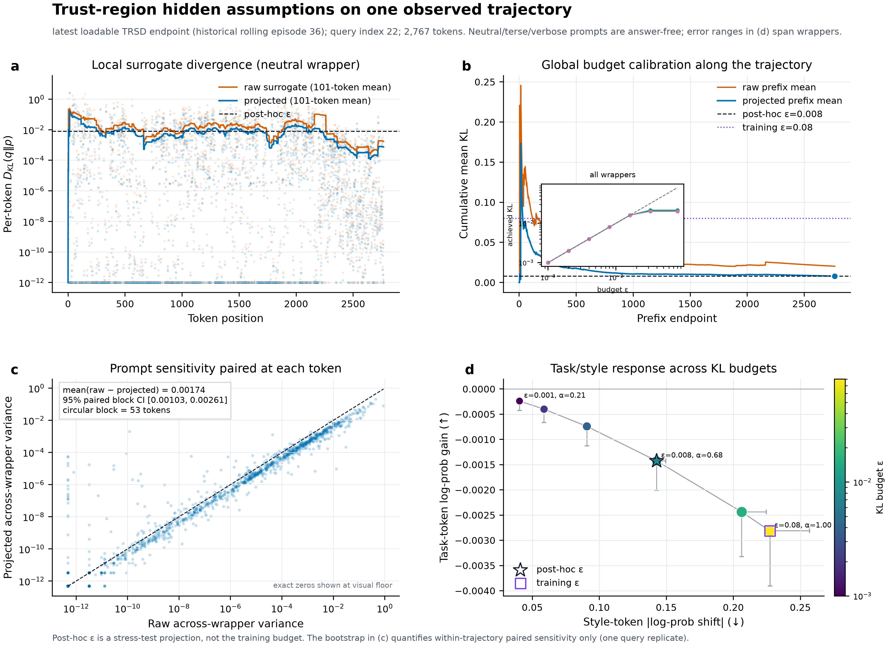

# Trust-Region Self-Distillation

## Controlling privileged-context drift through exact exponential teacher projection

This document presents the method and empirical protocol for **Trust-Region
Self-Distillation (TRSD)**. It is written as a paper-style research description:
the focus is the scientific problem, mathematical construction, information
boundary, hypotheses, and experiments—not implementation details.

> **Central idea.** A teacher-only, answer-free reasoning instruction may expose
> a useful direction in the current model, but it may also induce broad
> prompt-conditioned behavior. TRSD therefore does not distill the raw
> privileged distribution. It computes the closest teacher to that distribution
> that remains inside a trajectory-level KL ball centered on the student, and
> distills only this projected target on the student's own prefixes.

The central claim is deliberately narrow: **trust region as clean** means that
the target entering self-distillation is student-centered, globally
KL-controlled, causal, and free of target-answer hindsight. It does not mean
that privileged information never appears, or that task and style can be
perfectly separated without supervision.

---

## 1. Motivation

### 1.1 Why use a privileged surrogate?

Self-distillation has no external expert. A natural alternative is to score the
student's trajectory with the same model under an additional pre-decision
reasoning instruction. The ordinary student sees the problem and its own
prefix. The surrogate additionally receives an answer-free instruction to
decompose the problem, track constraints and invariants, test boundary cases,
and verify alternative derivations.

This extra context can reveal query-relevant competence already latent in the
model. It may increase probability on useful decisions without requiring a
larger teacher, a verifier, multiple sampled solutions, or the target answer.
However, the resulting distribution is only a **surrogate direction**, not an
oracle. Prompting can change response length, certainty, self-correction,
reference-like wording, and many other tokens that are not necessarily
transferable when the student later acts without that prompt.

### 1.2 Why not distill the raw privileged teacher?

Let the current student's next-token distribution at position $t$ be

\[
p_t(v)=\pi_{\theta}(v\mid x,y_{<t}),
\]

where $y\sim\pi_\theta(\cdot\mid x)$ is generated on-policy. Let the raw
privileged surrogate be

\[
q_t^P(v)=\pi_{\theta}(v\mid x,m,y_{<t}),
\]

where $m$ is the answer-free reasoning-method instruction. Its tokenwise
log-ratio relative to the student is

\[
a_t^P(v)=\log q_t^P(v)-\log p_t(v).
\tag{1}
\]

Equation (1) mixes at least two effects:

\[
\text{potential task correction}
\quad+\quad
\text{privileged-context response drift}.
\]

Direct privileged self-distillation uses the complete shift, equivalent to
accepting every component of $a_t^P$ at full strength. TRSD instead treats the
surrogate as a proposal whose magnitude must be justified relative to the
student's current policy.

---

## 2. Information boundary

At position $t$, the model-facing TRSD procedure may use only

\[
\mathcal F_t=\{x,\;m,\;y_{<t},\;\theta\}.
\]

It does **not** expose the target answer, a reference solution, a correctness
label, a reward, previous-attempt feedback, future response tokens, or any
post-outcome signal. The prefix $y_{<t}$ is sampled by the ordinary student
before the episode update.

| Property | Base | Raw privileged SD | TRSD |
|---|---:|---:|---:|
| Ordinary problem $x$ | Yes | Yes | Yes |
| Student-generated causal prefix $y_{<t}$ | Yes | Yes | Yes |
| Answer-free pre-decision method instruction $m$ | No | Yes | Yes, only to propose direction |
| Target answer or reference solution | No | No | No |
| Future tokens or post-outcome feedback | No | No | No |
| Final distillation target bounded around student | — | No | Yes |

Two notions of context must not be conflated:

- **On-policy prefix parity is one:** student and teacher are evaluated on the
  same realized response prefix.
- **Strict prompt parity is zero:** the raw surrogate has the additional method
  instruction $m$.

Thus TRSD is hindsight-free in the present protocol, but it is not an
identical-prompt teacher. Its contribution is to control the distributional
effect of that teacher-only prompt before learning.

---

## 3. Method

### 3.1 Student-centered trajectory projection

For a student trajectory with $T$ scored positions, TRSD chooses projected
distributions \(\{q_t\}_{t=1}^{T}\) by solving

\[
\begin{aligned}
\min_{\{q_t\}}
\quad &
\frac{1}{T}\sum_{t=1}^{T}
D_{\mathrm{KL}}\!\left(q_t\,\Vert\,q_t^P\right)\\
\text{subject to}\quad &
\frac{1}{T}\sum_{t=1}^{T}
D_{\mathrm{KL}}\!\left(q_t\,\Vert\,p_t\right)
\le \varepsilon,
\qquad q_t\in\Delta^{|\mathcal V|-1}.
\end{aligned}
\tag{2}
\]

The objective retains as much of the surrogate distribution as possible. The
constraint imposes a single budget on the average movement along the complete
trajectory. Consequently, many small prompt-induced shifts at different token
positions spend the same shared budget rather than receiving independent
allowances.

### 3.2 Exact exponential projection

Introducing a Lagrange multiplier \(\lambda\ge 0\) for the trajectory-level
constraint and normalization multipliers for each position gives

\[
\mathcal L
=\sum_t D_{\mathrm{KL}}(q_t\Vert q_t^P)
+\lambda\!\left[
\sum_tD_{\mathrm{KL}}(q_t\Vert p_t)-T\varepsilon
\right].
\]

Stationarity with respect to every $q_t(v)$ yields

\[
q_t^C(v)
=
\frac{
p_t(v)^{\frac{\lambda}{1+\lambda}}
q_t^P(v)^{\frac{1}{1+\lambda}}
}{
\sum_u
p_t(u)^{\frac{\lambda}{1+\lambda}}
q_t^P(u)^{\frac{1}{1+\lambda}}
}.
\]

Defining \(\alpha=1/(1+\lambda)\in[0,1]\), the solution becomes

\[
\boxed{
q_t^C(v)
=
\frac{p_t(v)^{1-\alpha}q_t^P(v)^\alpha}
{\sum_u p_t(u)^{1-\alpha}q_t^P(u)^\alpha}
}
\tag{3}
\]

or, in logit form,

\[
q_t^C
=\operatorname{softmax}\!\left((1-\alpha)z_t^S+\alpha z_t^P\right).
\tag{4}
\]

This is geometric interpolation in probability space, not linear probability
averaging. The student remains the base measure and the privileged log-ratio is
an exponential tilt whose strength is constrained.

For full-support softmax distributions, the objective is convex and the
stationary solution is the unique constrained optimum. This is the precise
sense in which TRSD returns the **globally best feasible teacher**: among all
targets inside the specified student-centered KL ball, it is closest to the raw
privileged surrogate under the objective in Equation (2). This is not a claim
that it is the globally best policy for mathematical accuracy.

### 3.3 One adaptive coefficient for the whole trajectory

Define the achieved trajectory divergence along the exponential path as

\[
K(\alpha)
=\frac{1}{T}\sum_t
D_{\mathrm{KL}}\!\left(q_t^{(\alpha)}\Vert p_t\right).
\tag{5}
\]

Writing \(a_t(v)=\log q_t^P(v)-\log p_t(v)\), differentiation gives

\[
K'(\alpha)
=\frac{\alpha}{T}\sum_t
\operatorname{Var}_{q_t^{(\alpha)}}[a_t]\ge 0.
\tag{6}
\]

Therefore $K(\alpha)$ is monotone. TRSD selects

\[
\alpha^*
=\max\{\alpha\in[0,1]:K(\alpha)\le\varepsilon\}.
\tag{7}
\]

If $K(1)\le\varepsilon$, the raw surrogate already lies inside the trust
region and the exact KKT solution is \(\alpha^*=1\). Otherwise the constraint
is active and the unique boundary solution can be found by a scalar bisection.
The coefficient is thus automatically adapted per trajectory once
\(\varepsilon\) is specified. This removes a globally tuned interpolation
coefficient, although the KL budget itself remains a scientific design choice
that must be calibrated and reported.

The single shared \(\alpha^*\) is essential. A per-token budget could allow a
large number of individually small style changes to pass independently. A
trajectory-level budget aggregates them and controls total response-level
movement.

### 3.4 On-policy persistent distillation

One training episode has four conceptual operations:

1. The persistent student generates one trajectory from the ordinary problem
   prompt.
2. The same model under the answer-free method instruction scores the exact
   student prefixes, without generating an alternative solution.
3. Equation (3) projects the raw surrogate into the student-centered
   trajectory KL ball.
4. The projected distributions are detached and the student minimizes

\[
\mathcal L_{\mathrm{SD}}(\theta)
=\frac1T\sum_t
D_{\mathrm{KL}}\!\left(
\operatorname{sg}[q_t^C]
\,\Vert\,
\pi_\theta(\cdot\mid x,y_{<t})
\right).
\tag{8}
\]

The resulting parameters persist to the next DeepMath episode. The temporary
surrogate and projected distributions are discarded. The additional projection
requires no extra language-model generation; compared with raw privileged
self-distillation, it adds full-vocabulary logit arithmetic, KL evaluation, and
a one-dimensional search.

---

## 4. What “clean and stable” means

TRSD provides several exact, inspectable properties:

1. **No target-answer hindsight.** The current protocol excludes answers,
   reference solutions, rewards, future tokens, and post-outcome feedback from
   the model-facing training path.
2. **On-policy state support.** The distillation states are prefixes actually
   visited by the current student.
3. **A normalized target.** The projected teacher is a valid distribution, not
   a clipped or unnormalized advantage vector.
4. **Exact feasible optimum.** For fixed logits and the observed trajectory,
   Equation (3) solves Equation (2).
5. **Trajectory-level distribution control.** The projected target satisfies
   mean \(D_{\mathrm{KL}}(q_t^C\Vert p_t)\le\varepsilon\), up to numerical
   tolerance.
6. **Conservative fallback in distribution space.** As \(\varepsilon\to0\),
   the target approaches the student; if the raw surrogate is already feasible,
   it is retained.

The method does **not** guarantee that the surrogate is correct, that every
projected update improves accuracy, that semantic task and style components are
identifiable without labels, or that an SGD step stays inside a parameter-space
trust region. The KL guarantee applies to teacher distributions on one observed
trajectory before the optimizer update; generalization to unseen states is an
empirical question.

---

## 5. Empirical hypotheses

The empirical study is organized around four hidden assumptions rather than a
collection of disconnected diagnostics.

| Hypothesis | Scientific question | Required evidence |
|---|---|---|
| H1: surrogate utility | Does the answer-free privileged direction contain task signal? | Correct-vs-incorrect trajectory separation and held-out transfer |
| H2: local usefulness | Is only a bounded portion of the raw direction useful? | Accuracy/task signal versus KL budget and raw-surrogate comparison |
| H3: cumulative prompt drift | Does wording-induced drift accumulate across a response? | Token-position KL, trajectory calibration, wrapper variance, style proxies |
| H4: persistent transfer | Does the projected signal survive in a student that no longer receives the privileged prompt? | Sealed held-out accuracy, paired flips, checkpoint accumulation, stability |

These hypotheses separate mechanism evidence from downstream evidence. Exact KL
calibration can validate the projection, but it cannot by itself prove improved
mathematical solving. Conversely, aggregate accuracy alone cannot show that the
trust-region mechanism caused a cleaner transfer.

---

## 6. Data and experimental protocol

### 6.1 Model and distillation stream

The proof of concept uses a pinned `Qwen/Qwen3-8B` model revision. Persistent
training consumes a deterministic stream of 1,000 unique DeepMath problems from
difficulty levels 7–10. A disjoint 200-problem DeepMath development set is
reserved for selecting the KL budget and training configuration.

For TRSD, each model-facing record contains the problem and provenance only.
Dataset answers and reference solutions are physically separated from the GPU
training interface. They may be used only by a sealed offline evaluator after a
generation artifact has been committed. This firewall is central to the
hindsight-free claim.

The training configuration uses LoRA rank 8 with scale 16, learning rate
\(2\times10^{-5}\), a maximum training sequence length of 16,384 tokens, and
full-vocabulary trust-region evaluation in bounded token chunks. The historical
pilot used \(\varepsilon=0.08\), which the mechanism audit found too loose. We
therefore ran the inexpensive label-free sensitivity study in Study 4. Its
registered selection rule chooses \(\varepsilon=0.004\), which is now the
provisional default for the next matched TRSD training run.

### 6.2 Held-out test sets

| Dataset | Problems | Role |
|---|---:|---|
| AMC23 | 83 | larger, relatively easier held-out set |
| AIME24 | 30 | difficult held-out set |
| AIME25 | 30 | difficult held-out set |
| Combined | 143 | primary aggregate |

All methods use the same evaluation prompt, decoding parameters, query order,
and paired random seed. The current final-checkpoint evaluation allows at most
10,240 generated tokens in a 40,960-token context window, with temperature 0.6,
top-\(p=0.95\), top-\(k=20\), and one sample per query. Therefore the current
primary outcome is **Acc@1**, not Mean@4.

The 10,240-token cap is an efficiency-controlled benchmark, not proof that all
models have completed every derivation. A response that does not emit a
parseable final answer before the cap is scored incorrect. Accuracy must
therefore be accompanied by answer coverage, truncation, and response length.

### 6.3 Methods and endpoint provenance

The final main table will compare:

- **Base:** the pinned model before persistent self-distillation;
- **Privileged-SD-64:** direct distillation from the answer-free pre-decision
  surrogate after 64 historical episodes;
- **TRSD-current:** a newly trained exponential-projection checkpoint using
  the frozen epsilon selected on the development split.

The previously adopted rolling episode-36 checkpoint has historical
`correct_wrong_signed:trust_region` provenance and is not a checkpoint of the
current exponential-projection TRSD algorithm. It is therefore excluded from
the current method claim and retained only as a fixed model state for the
post-hoc geometry pilot in Study 3. A causal TRSD-versus-Privileged-SD
comparison requires a newly trained checkpoint with equal episodes, examples,
optimizer steps, and seeds.

---

## 7. Empirical studies

### Study 1: Final-checkpoint mathematical performance

**Question.** Does the persistent student solve more held-out AMC/AIME problems
without receiving the privileged prompt at inference time?

For each method, we report Acc@1 on AMC23, AIME24, AIME25, and their union. For
every comparison with Base, query-level pairing produces:

- Base-wrong \(\rightarrow\) method-correct;
- Base-correct \(\rightarrow\) method-wrong;
- the paired accuracy difference and an exact paired uncertainty/test;
- answer coverage and truncation;
- seconds per query and peak GPU memory.

The table remains intentionally unfilled until all label-blind generation
shards complete and the sealed scorer has joined answers.

| Method | Endpoint | AMC23 Acc@1 | AIME24 Acc@1 | AIME25 Acc@1 | Combined Acc@1 | W→C | C→W | Trunc. | Sec/query | Peak memory |
|---|---:|---:|---:|---:|---:|---:|---:|---:|---:|---:|
| Base | 0 | pending | pending | pending | pending | — | — | pending | pending | pending |
| Privileged-SD | 64 | pending | pending | pending | pending | pending | pending | pending | pending | pending |
| TRSD | current, epsilon-calibrated | pending new training | pending | pending | pending | pending | pending | pending | pending | pending |

No positive accuracy claim is made before this table is complete.

### Study 2: Persistent accumulation and stability

**Question.** Does answer-free projected self-distillation accumulate useful
behavior rather than merely perturbing one response?

For a persistent student \(\theta_k\) after $k$ episodes, define

\[
A_k=\operatorname{Acc@1}(\theta_k;\mathcal D_{\mathrm{heldout}}),
\qquad
\operatorname{LHG}_K=A_K-A_0.
\tag{9}
\]

With several matched checkpoints, the observed area above Base is

\[
\operatorname{AULC}
=\frac{1}{K}\int_0^K(A_k-A_0)\,\mathrm dk,
\tag{10}
\]

approximated over the evaluated episode grid. Stability is assessed jointly
through accuracy, correct-to-wrong regressions, KL drift, truncation, response
length, and across-checkpoint variance. A final endpoint alone cannot establish
a long-horizon crossover. This study starts only after the development-set
epsilon rule is frozen and a current TRSD run is trained from the same Base
state as the comparison baseline.

### Study 3: Exact mechanism and surrogate-prompt sensitivity

**Question.** Does the projection enforce its global budget, and does it reduce
the part of the surrogate distribution that depends on prompt wording?

We fix one real, label-free DeepMath trajectory generated from a historical
model state (episode 36; query index 22; 2,767 scored tokens). The
same prefixes are scored under three semantically equivalent answer-free
method prompts: neutral, terse, and verbose. We recompute exact full-vocabulary
projection statistics over

\[
\varepsilon\in
\{0.001,0.002,0.004,0.008,0.016,0.032,0.08\}.
\]

The historical pilot training budget is \(0.08\). The value \(0.008\) is a post-hoc
stress test used to expose the active projection mechanism, not a retrospectively
substituted training configuration.

*Figure 1: Exact full-vocabulary diagnostics on one observed, label-free
DeepMath trajectory at a fixed historical model state. Panel (a) contrasts raw and projected tokenwise KL; panel
(b) verifies the shared trajectory budget; panel (c) measures sensitivity to
three answer-free prompt paraphrases; panel (d) traces task/style proxies across
KL budgets. The interval is a within-trajectory moving-block bootstrap, not a
query-level confidence interval. [PDF](docs/figures/trust_region_mechanism_query_0022.pdf)
· [summary CSV](docs/results/trust_region_mechanism_query_0022_summary.csv) ·
[epsilon sweep CSV](docs/results/trust_region_mechanism_query_0022_epsilon_sweep.csv).*

**Observed mechanism result.** For the neutral wrapper, the raw surrogate has
trajectory-mean KL \(0.020346\). At the stress-test budget
\(\varepsilon=0.008\), Equation (7) selects \(\alpha=0.675\) and obtains mean
KL \(0.007996\). The across-wrapper token-level variance falls from
\(0.002546\) before projection to \(0.000807\) after projection, a 68.3%
relative reduction. The paired circular moving-block bootstrap gives a positive
absolute reduction interval \([0.001029, 0.002615]\).

Across the three wrappers, the stress-test projection reduces the mean absolute
style-token log-probability shift by approximately 39.5% relative to the raw
surrogate. On this particular trajectory, the realized task-token shift is
negative rather than beneficial; projection reduces its adverse magnitude by
approximately 48.0%. This supports the narrower claim that the trust region can
limit surrogate-prompt sensitivity and harmful movement. It does **not** show
positive task gain on this query.

The same result also exposes a configuration issue: at the historical training
budget \(\varepsilon=0.08\), all three raw surrogates are already feasible
(mean KL roughly 0.020–0.022), so the exact solution is \(\alpha=1\) and the
constraint is inactive. Hence strong empirical claims about projection-induced
cleaning require a tighter, development-set-calibrated budget or an explicitly
adaptive budget policy followed by new training. The post-hoc stress test
diagnoses the mechanism; it does not rewrite the historical training run.

This study has one query replicate and does not validate training with the
current TRSD algorithm. Its block-bootstrap interval measures
within-trajectory sensitivity across token positions, not population-level or
query-level generalization.

### Study 4: One-episode label-free epsilon sensitivity

**Question.** Which global KL budget makes the projection active and
prompt-robust while retaining a meaningful portion of task-bearing surrogate
movement?

For a cheap setting check, the pinned Base model generates one fixed on-policy
trajectory from one query-only DeepMath development problem. Answers and
reference solutions remain sealed. The same 4,096-token trajectory is scored
under neutral, terse, and verbose answer-free method prompts at

\[
\mathcal E=\{0.001,0.002,0.004,0.008,0.016,0.032,0.08\}
\]

with exact full-vocabulary KL. The H100 job completes in 2 minutes 1 second.
No AMC/AIME query or target label participates in this sensitivity study.

The rule chooses the **largest** epsilon that activates all three wrappers,
retains at least 50% of raw task-token shift magnitude, retains at most 75% of
raw style-token shift, and retains at most 50% of raw across-wrapper token-level
variance. This makes the choice conservative without collapsing the surrogate
direction to the student.

The signed task-token statistic is not used as a correctness score. The
selection uses only magnitude retention in a frozen token partition, and the
result must still be validated by retraining and sealed held-out accuracy.

| Epsilon | Mean alpha | Achieved KL | Active wrappers | Task-token gain ↑ | Style shift ↓ | Prompt variance retained ↓ |
|---:|---:|---:|---:|---:|---:|---:|
| 0.001 | 0.323 | 0.001000 | 3/3 | 0.001313 | 0.0271 | 9.7% |
| 0.002 | 0.473 | 0.002000 | 3/3 | 0.001589 | 0.0398 | 20.9% |
| **0.004** | **0.702** | **0.004000** | **3/3** | **0.001686** | **0.0594** | **46.7%** |
| 0.008 | 0.995 | 0.007230 | 1/3 | 0.001295 | 0.0852 | 98.0% |
| 0.016 | 1.000 | 0.007290 | 0/3 | 0.001278 | 0.0857 | 100.0% |
| 0.032 | 1.000 | 0.007290 | 0/3 | 0.001278 | 0.0857 | 100.0% |
| 0.080 | 1.000 | 0.007290 | 0/3 | 0.001278 | 0.0857 | 100.0% |

The raw surrogate corresponds to \(\alpha=1\). Relative to that reference,
\(\varepsilon=0.004\) retains 131.9% of the signed task-token gain, 69.3% of
the absolute style shift, and 46.7% of prompt-wording variance. In contrast,
\(\varepsilon=0.008\) is inactive for two of three wrappers and is nearly
indistinguishable from the raw surrogate. Thus 0.004 is the largest setting
that satisfies the one-episode rule and is adopted as the provisional training
default. [Source table](docs/results/trsd_epsilon_one_episode.csv).

The rollout reaches the 4,096-token cap. This does not invalidate the
teacher-forced distribution comparison on the observed prefixes, but it means
the experiment is a mechanism sensitivity result—not an accuracy result or a
population-level hyperparameter study.

---

## 8. Metrics

### 8.1 Task performance

\[
\operatorname{Acc@1}
=\frac{1}{N}\sum_{i=1}^{N}
\mathbf 1[\widehat a_i=a_i],
\qquad
\operatorname{STG}=\operatorname{Acc@1}_{\mathrm{method}}
-\operatorname{Acc@1}_{\mathrm{Base}}.
\]

Because outcomes are paired by query, aggregate differences are always
reported with wrong-to-correct and correct-to-wrong counts. Answer coverage and
truncation distinguish mathematical failure from failure to emit a final answer
under the evaluation cap.

### 8.2 Hindsight and context

\[
\operatorname{HER}
=\frac{\text{teacher positions exposed to target outcome information}}
{\text{all teacher positions}}.
\]

For the present answer-free pre-decision protocol, HER is zero by construction
subject to the data-firewall audit. We separately report:

- **prefix parity:** fraction of positions with the same problem and realized
  student prefix; expected to be one;
- **strict prompt parity:** fraction with identical full prompt context;
  expected to be zero for both raw privileged SD and TRSD.

This vector is more informative than assigning a single “clean” scalar. In
particular, a metric that multiplies performance by strict prompt parity would
necessarily be zero for TRSD and would fail to represent its student-centered
projection.

### 8.3 Distributional drift

The principal exact metric is achieved trajectory-mean
\(D_{\mathrm{KL}}(q^C\Vert p)\), together with selected \(\alpha\), budget
slack, and constraint activation. Prompt sensitivity is the variance of the
surrogate or projected distribution across answer-free paraphrases at paired
token positions.

Token lexicons partition realized tokens into frozen **task**, **style**, and
**other** categories. We report absolute teacher–student realized-token
log-probability discrepancy and their ratio. These are observable distributional
proxies, not a semantic judgment of response quality. Output-level diagnostics
include hedging markers per 1,000 tokens, reference-like phrases, response
length, entropy, EOS behavior, and truncation.

### 8.4 Efficiency

Every method reports end-to-end seconds per episode or query, generated tokens,
optimizer steps, process memory, and peak GPU memory. Projection arithmetic adds
no model rollout, but it is not free; measured overhead is reported rather than
inferred from forward-pass counts.

---

## 9. Claim–evidence ledger

| Claim | Evidence | Current status | Permitted conclusion |
|---|---|---|---|
| TRSD excludes target-answer hindsight | Query-only model inputs and sealed-label boundary | Protocol supported | The implemented training path is answer-free and pre-decision |
| Exponential interpolation is the exact feasible projection | KKT derivation, Equations (2)–(7) | Analytically supported | Globally optimal for the stated distributional surrogate objective |
| Projection satisfies the trajectory KL budget | Exact full-vocabulary sweep | Supported on the observed mechanism trajectory | The active projection reaches the specified mean-KL boundary |
| Projection reduces wrapper sensitivity | Three-wrapper paired trajectory analysis | Supported on one trajectory | Local prompt-sensitivity reduction, not population robustness |
| Historical \(\varepsilon=0.08\) cleans the teacher strongly | Constraint-activation audit | Not supported | The historical budget is loose and often leaves \(\alpha=1\) |
| Provisional \(\varepsilon=0.004\) balances retention and prompt robustness | One Base-model DeepMath development trajectory and three answer-free wrappers | Supported on one episode | Use as the next-run default, not a population-optimal claim |
| Current TRSD improves held-out mathematical accuracy | Newly trained current checkpoint and complete sealed 143-query main table | Pending epsilon selection and retraining | No current-method accuracy conclusion yet |
| Current TRSD is more stable over long horizons | Matched checkpoint curves and multiple seeds | Pending | Not established by a historical endpoint |
| Current TRSD outperforms Privileged-SD | Matched-horizon paired comparison | Pending a current matched run | Historical unequal-horizon results do not identify this claim |
| TRSD is inexpensive | Matched time and memory for the current implementation | Pending | Projection adds no rollout, but measured cost is required |

---

## 10. Interpretation and next decisive experiment

The completed sensitivity study verifies the mathematical mechanism and
reveals the most important setting change: **0.08 is fully inactive and 0.008
is still almost inactive on the observed Base trajectory, whereas 0.004 lies at
the desired retention–robustness boundary.** The decisive follow-up is to train
current TRSD with \(\varepsilon=0.004\) and raw Privileged-SD for a matched
number of episodes and seeds, then evaluate both once on the sealed AMC/AIME
suite. That experiment tests whether local reduction in surrogate sensitivity
transfers into a better accuracy–stability trade-off.

Until then, the strongest supported statement is:

> **TRSD provides an exact, causal, student-centered projection of an
> answer-free privileged surrogate. On one real trajectory, an active trust
> region precisely enforced its KL budget and substantially reduced sensitivity
> to equivalent privileged-prompt wordings. A cheap Base-model sensitivity
> study selects 0.004 as the largest locally active budget that retains the task
> proxy while contracting style and prompt sensitivity. Held-out mathematical
> improvement still requires a newly trained current TRSD checkpoint and cannot
> be inferred from projection geometry.**
