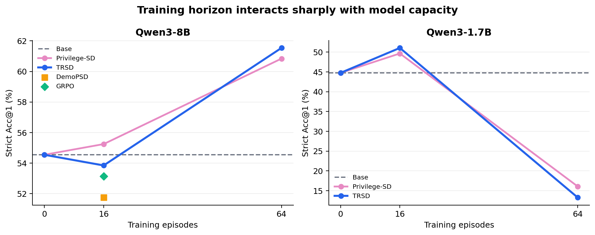
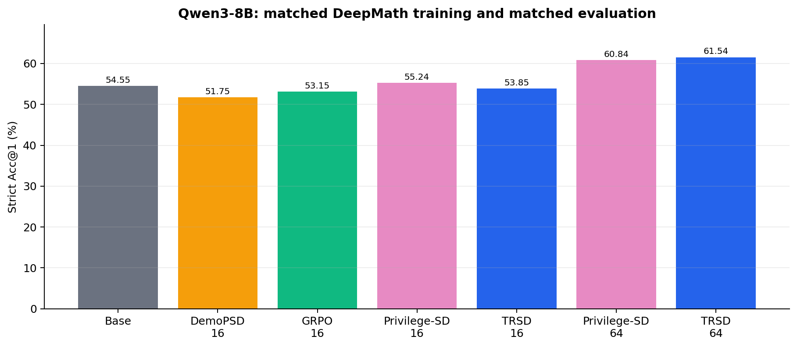
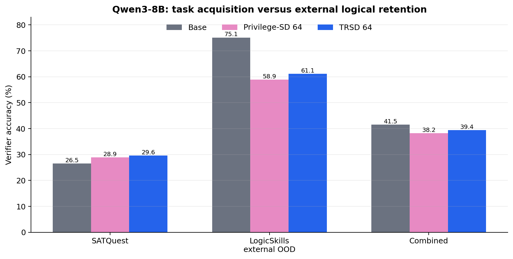

# Expanded TRSD validation: model scale, baselines, and logical transfer

This bundle adds three matched evaluations to the 64-episode TRSD result story. Training horizons are exactly matched within every comparison. Math results use the same 143 AMC23/AIME24/AIME25 query IDs and a shared 10,240-token strict Acc@1 protocol. Logical results use all 3,360 SATQuest tasks and all 1,500 LogicSkills tasks with deterministic PySAT/Z3-backed verification.

## Result map

| Question | Main result | Evidence |
|---|---|---|
| Short-term performance | On Qwen3-1.7B, TRSD-16 reaches **51.05%**, +6.29 pp over Base and +1.40 pp over Privilege-SD-16. | `tables/qwen3_1p7b_math.csv` |
| Long-term performance | On Qwen3-8B, TRSD-64 reaches **61.54%**, +6.99 pp over Base, +0.70 pp over matched Privilege-SD-64, and +8.39 pp over GRPO-16. | `tables/qwen3_8b_math.csv` |
| Drift control | At 64 matched episodes, TRSD gains +3.12 pp on SATQuest and retains **2.20 pp** more LogicSkills accuracy than Privilege-SD. | `tables/qwen3_8b_logic_dataset.csv` |

The scale comparison exposes a sharp capacity–horizon interaction. Sixteen episodes are already useful for the 1.7B model, but 64 episodes drive both 1.7B branches into short-answer collapse: Privilege-SD-64 falls to 16.08% and TRSD-64 to 13.29%. Qwen3-8B converts the same 64-episode horizon into sustained gains instead, reaching 60.84% with Privilege-SD and 61.54% with TRSD. The long-run gain is therefore realized when model capacity supports the extended trajectory.

## Qwen3-8B math: TRSD, Privilege-SD, DemoPSD, and GRPO

| Method | Episodes | AMC23 | AIME24 | AIME25 | Combined | Delta vs Base |
|---|---:|---:|---:|---:|---:|---:|
| Base | 0 | 56/83 | 14/30 | 8/30 | **78/143 (54.55%)** | +0.00 pp |
| Privilege-SD | 16 | 57/83 | 13/30 | 9/30 | **79/143 (55.24%)** | +0.70 pp |
| TRSD | 16 | 54/83 | 14/30 | 9/30 | **77/143 (53.85%)** | -0.70 pp |
| DemoPSD | 16 | 53/83 | 13/30 | 8/30 | **74/143 (51.75%)** | -2.80 pp |
| GRPO | 16 | 56/83 | 12/30 | 8/30 | **76/143 (53.15%)** | -1.40 pp |
| Privilege-SD | 64 | 62/83 | 13/30 | 12/30 | **87/143 (60.84%)** | +6.29 pp |
| TRSD | 64 | 62/83 | 14/30 | 12/30 | **88/143 (61.54%)** | +6.99 pp |

The 16-episode methods form a tight early cluster around the base model. The separation emerges over the 64-episode trajectory: TRSD adds ten correct answers over Base and finishes one answer ahead of the matched Privilege-SD branch. The gain spans AMC23 and AIME25 while holding AIME24 at the base model's 14/30.

## Qwen3-1.7B math: short- and long-horizon behavior

| Method | Episodes | AMC23 | AIME24 | AIME25 | Combined |
|---|---:|---:|---:|---:|---:|
| Base | 0 | 47/83 | 10/30 | 7/30 | **64/143 (44.76%)** |
| Privilege-SD | 16 | 55/83 | 9/30 | 7/30 | **71/143 (49.65%)** |
| TRSD | 16 | 56/83 | 7/30 | 10/30 | **73/143 (51.05%)** |
| Privilege-SD | 64 | 20/83 | 2/30 | 1/30 | **23/143 (16.08%)** |
| TRSD | 64 | 19/83 | 0/30 | 0/30 | **19/143 (13.29%)** |

At 16 episodes, TRSD produces the strongest 1.7B result and shifts success toward AIME25. At 64 episodes, generated responses contract from 7,177 tokens on average for TRSD-16 to 1,233 for TRSD-64, and TRSD records zero correct answers on both AIME subsets. This directly identifies response collapse, rather than decoding-budget exhaustion, as the long-horizon 1.7B failure mode.

## Qwen3-8B logical transfer

| Method | SATQuest | LogicSkills external OOD | Combined |
|---|---:|---:|---:|
| Base | **891/3,360 (26.52%)** | **1,127/1,500 (75.13%)** | **2,018/4,860 (41.52%)** |
| Privilege-SD-64 | **972/3,360 (28.93%)** | **884/1,500 (58.93%)** | **1,856/4,860 (38.19%)** |
| TRSD-64 | **996/3,360 (29.64%)** | **917/1,500 (61.13%)** | **1,913/4,860 (39.36%)** |

The matched 64-episode branches both acquire more SAT-style competence from the math trajectory while losing first-order external-OOD accuracy. TRSD moves the frontier outward on both axes relative to Privilege-SD: +0.71 pp on SATQuest and +2.20 pp on LogicSkills. The trust-region projection therefore improves target acquisition and preserves more external logical skill at the same training horizon.

## Protocol and audit trail

- Math: one sample per query; temperature 0.6; top-p 0.95; top-k 20; identical query seeds; batched vLLM; 10,240 generated-token cap; strict correctness requires a correct boxed answer before the cap.
- Logic: greedy pass@1 with Qwen3 thinking enabled; 10,240 generated-token cap; six SATQuest problem types across ID, size OOD, format OOD, and joint size-format OOD; all three LogicSkills tasks.
- Verification: SATQuest uses `Problem.check`; LogicSkills uses Z3-backed symbolization and countermodel checks plus exact validity-option checking.
- Row-level evidence contains all 1,001 Qwen3-8B math outcomes, 715 Qwen3-1.7B math outcomes, and 14,580 logical outcomes. Responses are represented by SHA-256 digests so the bundle remains compact while preserving exact linkage to the source runs.
- `MANIFEST.json` records SHA-256 hashes and byte sizes for every source result used to build the bundle.
