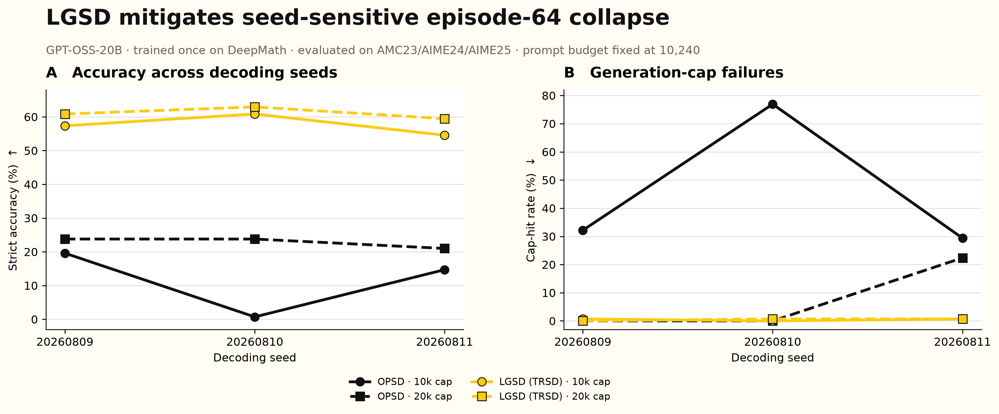

# GPT-OSS-20B: multi-decoding-seed collapse audit

## Scope

This report contains only the episode-64 collapse audit requested here: one completed DeepMath training run per method, evaluated repeatedly with three decoding seeds on AMC23, AIME24, and AIME25. It does **not** use Arena and it is **not** a multi-training-seed experiment.

The result is simple: the same OPSD checkpoint is highly seed-sensitive and alternates between premature short answers and cap-hitting degeneration, whereas LGSD (TRSD) remains substantially more accurate and stable under every evaluated decoding seed.

## Protocol

- Model: `openai/gpt-oss-20b`, revision `6cee5e81ee83917806bbde320786a8fb61efebee`.
- Training: one 64-episode DeepMath run for OPSD and one matched run for LGSD (TRSD), both from the same initialization.
- Checkpoints: OPSD `215c5135...16f0ad`; LGSD `6ce36049...f65646`.
- Evaluation: 143 held-out problems from AMC23, AIME24, and AIME25.
- Decoding seeds: `20260809`, `20260810`, and `20260811`.
- Inference: 2×H100 with tensor parallelism 2; temperature 0.6, top-p 0.95, and top-k 20.
- Token-budget check: the prompt always states a 10,240-token budget; only the engine cap changes from 10,240 to 20,480.
- Strict accuracy: an answer counts only when it is correct and not truncated.

## Complete per-seed results

| Method | Engine cap | Decoding seed | Correct | Accuracy ↑ | Cap hits ↓ | Cap-hit rate ↓ | Median tokens |
|:--|--:|--:|--:|--:|--:|--:|--:|
| OPSD | 10,240 | 20260809 | 28/143 | 19.6% | 46 | 32.2% | 112 |
| OPSD | 10,240 | 20260810 | 1/143 | 0.7% | 110 | 76.9% | 10,240 |
| OPSD | 10,240 | 20260811 | 21/143 | 14.7% | 42 | 29.4% | 86 |
| OPSD | 20,480 | 20260809 | 34/143 | 23.8% | 0 | 0.0% | 78 |
| OPSD | 20,480 | 20260810 | 34/143 | 23.8% | 0 | 0.0% | 78 |
| OPSD | 20,480 | 20260811 | 30/143 | 21.0% | 32 | 22.4% | 102 |
| **LGSD (TRSD)** | **10,240** | **20260809** | **82/143** | **57.3%** | **1** | **0.7%** | **1,032** |
| **LGSD (TRSD)** | **10,240** | **20260810** | **87/143** | **60.8%** | **0** | **0.0%** | **1,081** |
| **LGSD (TRSD)** | **10,240** | **20260811** | **78/143** | **54.5%** | **1** | **0.7%** | **1,007** |
| **LGSD (TRSD)** | **20,480** | **20260809** | **87/143** | **60.8%** | **0** | **0.0%** | **1,016** |
| **LGSD (TRSD)** | **20,480** | **20260810** | **90/143** | **62.9%** | **1** | **0.7%** | **1,027** |
| **LGSD (TRSD)** | **20,480** | **20260811** | **85/143** | **59.4%** | **1** | **0.7%** | **945** |

## Pooled result across the three decoding seeds

Each cell contains 429 evaluated responses (143 problems × 3 decoding seeds).

| Method | Engine cap | Correct | Pooled accuracy ↑ | Cap hits ↓ | Cap-hit rate ↓ | Median of run medians |
|:--|--:|--:|--:|--:|--:|--:|
| OPSD | 10,240 | 50/429 | 11.7% | 198 | 46.2% | 112 |
| OPSD | 20,480 | 98/429 | 22.8% | 32 | 7.5% | 78 |
| **LGSD (TRSD)** | **10,240** | **247/429** | **57.6%** | **2** | **0.5%** | **1,032** |
| **LGSD (TRSD)** | **20,480** | **262/429** | **61.1%** | **2** | **0.5%** | **1,016** |

At the 10,240-token cap, LGSD improves pooled accuracy over OPSD by **45.9 percentage points** and reduces the cap-hit rate by **45.7 points**. At 20,480 tokens, LGSD still leads by **38.2 accuracy points**. Thus extra inference budget helps OPSD, but it does not remove the collapse.

## What the three seeds reveal

The OPSD checkpoint has two failure modes. Seeds `20260809` and `20260811` mostly produce prematurely short outputs (median 112 and 86 tokens), while seed `20260810` frequently degenerates until the 10,240-token cap (76.9% cap-hit rate). Its strict accuracy consequently ranges from **0.7% to 19.6%**. In contrast, LGSD stays between **54.5% and 60.8%**, with roughly 1,000-token median responses and almost no cap hits.

Doubling the engine cap raises OPSD pooled accuracy from 11.7% to 22.8% and lowers its cap-hit rate from 46.2% to 7.5%. However, its median response remains only 78 tokens and its accuracy remains far below LGSD's 61.1%. The collapse therefore includes a completion-budget component, but it is not merely truncation: premature termination and broader sequence-control failure remain.

## Why policy drift is the supported explanation

On a fixed held-out probe (32 questions, 503 shared next-token positions), the episode-64 OPSD policy moves farther from initialization and retains less entropy than LGSD.

| Method | KL-to-initial policy ↓ | 95% bootstrap CI | Entropy retention ↑ |
|:--|--:|:--|--:|
| OPSD | 0.1834 | [0.1507, 0.2199] | 0.730 |
| **LGSD (TRSD)** | **0.0966** | **[0.0743, 0.1247]** | **0.891** |

LGSD's KL-to-initial policy is **47.3% lower**. The combined evidence supports the following interpretation: unrestricted OPSD updates accumulate more behavioral drift, so small decoding changes can select either an early-final mode or a repetitive cap-hitting mode. LGSD limits each privileged-target movement and leaves the final policy closer to initialization, making task completion more stable across decoding seeds.

This is an evidence-supported interpretation, not a proof that KL drift is the only causal mechanism. In addition, stochastic vLLM samples were not prefix-identical when `max_tokens` changed, even with a fixed prompt and seed. The 10k/20k experiment should therefore be described as **budget sensitivity**, not as deterministic continuation of the same 10k completion.

## Claim boundary

The supported claim is:

> Across three decoding seeds from the same episode-64 checkpoint, LGSD (TRSD) consistently mitigates the seed-sensitive behavioral collapse observed under OPSD; increasing the inference budget reduces part of OPSD's failure, but substantial accuracy loss, premature termination, and excess policy drift remain.

The experiment does **not** establish robustness across independent training seeds because training was intentionally performed only once per method.

## Claim–evidence map

| Claim | Direct evidence | Status |
|:--|:--|:--|
| LGSD mitigates collapse across decoding seeds. | LGSD achieves 54.5–60.8% at 10k versus OPSD's 0.7–19.6%. | Supported |
| Token cap explains part, but not all, of OPSD collapse. | OPSD improves by 11.2 points at 20k but remains 38.2 points below LGSD. | Supported |
| Accumulated policy drift is associated with collapse. | Episode-64 KL-to-initial is 0.1834 for OPSD versus 0.0966 for LGSD. | Supported as an association |
| LGSD is robust across training seeds. | Only one training run per method was used. | Not established |

Reviewer-facing scope check

- **Contribution:** isolates seed-sensitive completion failure at a fixed trained checkpoint.
- **Clarity:** training seed and decoding seeds are explicitly separated.
- **Experimental strength:** every reported method/cap cell contains three decoding runs and 429 responses.
- **Evaluation completeness:** training-seed replication remains outside the stated scope.
- **Method soundness:** checkpoints, prompts, datasets, hardware, and sampling settings are matched across methods.

