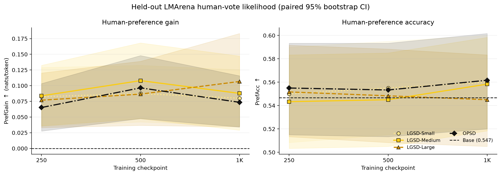
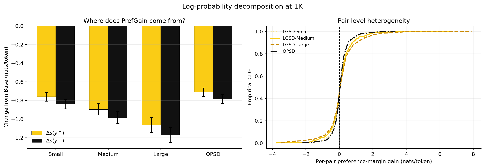
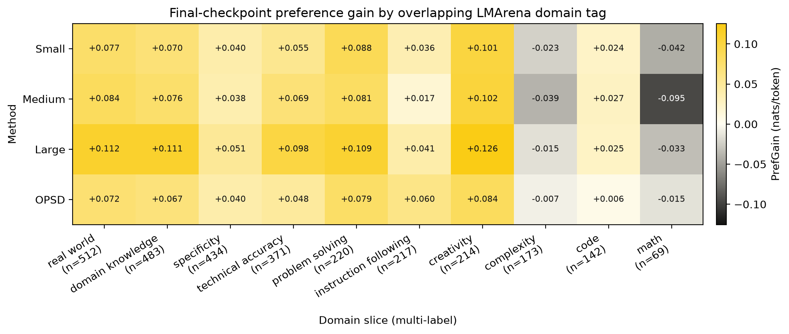
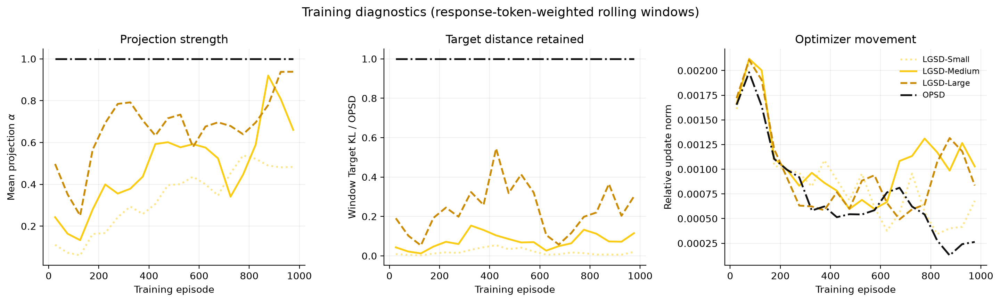
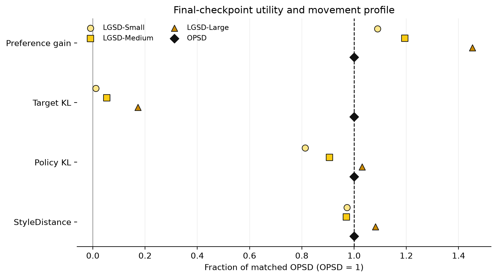

# Qwen3-8B Arena human-preference likelihood

At 1K, LGSD-Large has positive locality excess +0.0940 nats/token, with a paired 95% bootstrap lower bound of +0.0260.

This report uses one matched training seed and checkpoints 250, 500, 1K; preference N=600; fixed-prefix policy movement N=128; StyleDistance N=600 on the separate Arena-Hard split. `PrefGain` is a paired change from the frozen Base on existing human-voted responses. It is **not** a generated-response Arena win rate. No external LLM judge or Bradley--Terry model is used.

## Main table

| Method | Radius | Mean α | Target KL/raw ↓ | PrefGain/raw @250 ↑ | PrefGain/raw @500 ↑ | PrefGain/raw @1K ↑ | PrefAcc @1K ↑ | Policy/raw ↓ | Style/raw ↓ |
|---|---:|---:|---:|---:|---:|---:|---:|---:|---:|
| Base | 0 | -- | 0.000 | 0.000 | 0.000 | 0.000 | 0.547 | 0.000 | 0.000 |
| LGSD-Small | 0.001 | 0.339 | 0.012 | 1.264 | 0.906 | 1.089 | 0.560 | 0.812 | 0.973 |
| LGSD-Medium | 0.004 | 0.485 | 0.053 | 1.285 | 1.119 | 1.194 | 0.558 | 0.906 | 0.971 |
| LGSD-Large | 0.016 | 0.678 | 0.172 | 1.180 | 0.897 | 1.452 | 0.545 | 1.031 | 1.081 |
| OPSD | Raw | 1.000 | 1.000 | 1.000 | 1.000 | 1.000 | 0.562 | 1.000 | 1.000 |

Base preference margin is +0.06087 nats/token and Base preference accuracy is 0.547 on N=600 pairs.

## Complete figure suite

*Figure 1: PrefGain and PrefAcc across every completed checkpoint. Bands are query-paired 95% bootstrap intervals.*

*Figure 2: Preference gain retained versus target, learned-policy, and response-style movement retained at the final checkpoint. Points above the dashed line retain a larger fraction of preference gain than movement.*

*Figure 3: Change in preferred and rejected response log-probability, plus the full pair-level distribution of preference-margin gain.*

*Figure 4: Multi-domain slice audit on overlapping source tags. Each cell is a pair-macro PrefGain; prompts may appear in more than one column.*

*Figure 5: Projection strength, target distance retained, and optimizer movement during matched training.*

*Figure 6: Final normalized profile. OPSD is one for every raw-normalized metric; lower movement with comparable preference gain is the desired signature.*

## Claim--evidence map

| Claim | Evidence | Status |
|---|---|---|
| The evaluation uses existing human preferences without an LLM judge. | Pair manifest, score identities, and per-pair teacher-forced log-probabilities. | Supported |
| LGSD retains more preference gain than target movement. | Figure 2 and paired locality-excess CI at 1K. | Supported |
| The result persists through long multi-domain training. | Completed checkpoints: 250, 500, 1K. | Needs 5K/20K checkpoints |
| The metric is an Arena win rate. | No newly generated responses are compared. | Not claimed |

## Limitations

- The current run has one seed; confidence intervals quantify held-out pair uncertainty, not training-seed uncertainty.
- Preference likelihood measures ranking of recorded responses under teacher forcing, not open-ended generation quality.
- Target KL uses the response-token-weighted pre-update distillation KL and is normalized to matched OPSD.
- Policy KL and StyleDistance use separate, explicitly reported audit sets; they are aggregate locality diagnostics rather than per-pair causal mediators.
