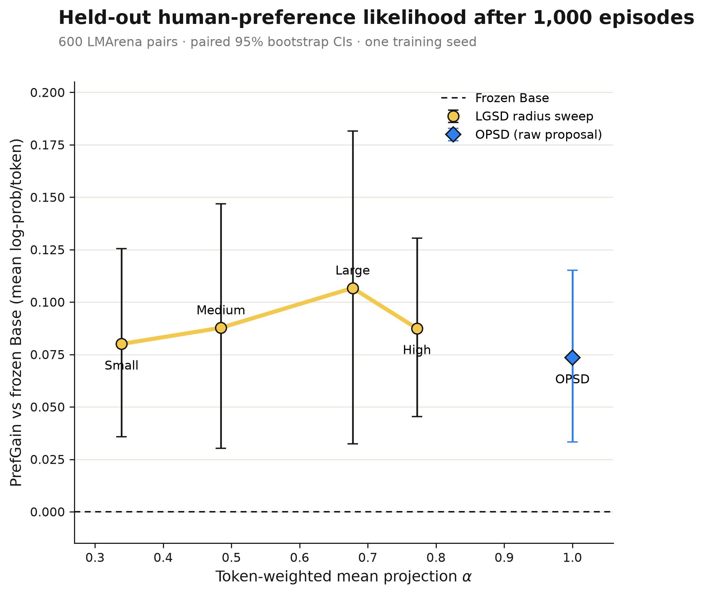
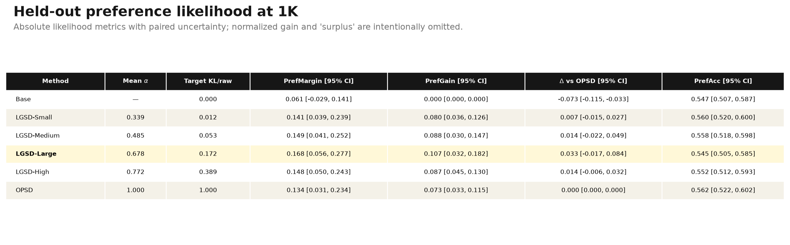
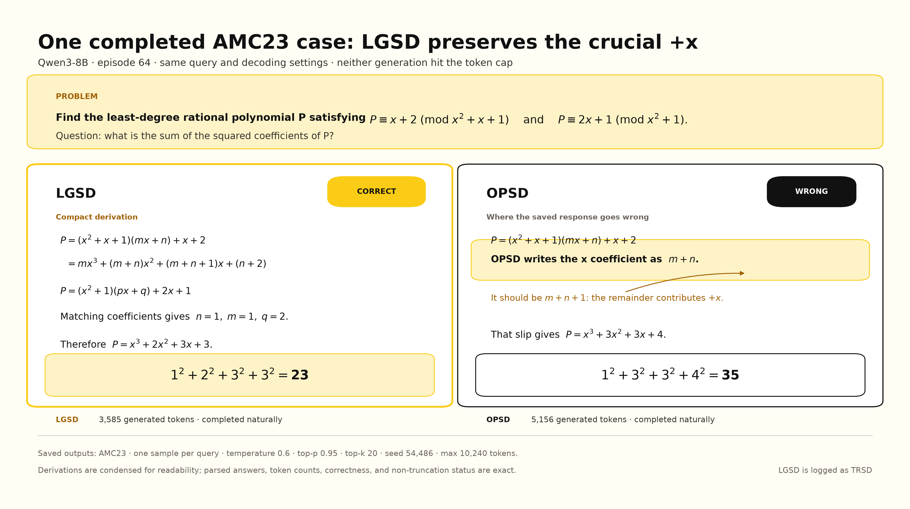

# Qwen3-8B Arena preference likelihood: reviewer-safe alpha sweep

At the 1K checkpoint, **LGSD-Large** has the largest preference-gain point
estimate in this matched sweep: token-weighted mean alpha is 0.678 and
`PrefGain = 0.107` mean log-probability per response token. Its paired 95%
bootstrap interval against the frozen Base is `[0.032, 0.182]`. The matched OPSD
estimate is `0.073 [0.033, 0.115]`.

The paired LGSD-Large minus OPSD difference is `0.033 [-0.017, 0.084]`. The
interval crosses zero, so the supported statement is that LGSD-Large has the
higher **point estimate in this one-training-seed sweep**; the current data do
not establish a statistically resolved advantage over OPSD. Increasing the
radius to 0.040 gives LGSD-High (mean alpha 0.772) and a point estimate closer to
OPSD, but this peak-and-convergence shape is descriptive rather than a universal
optimum claim.

`PrefGain` is computed on 600 existing LMArena human-voted response pairs using
teacher-forced mean token log-probability. It is **not** generated-response Arena
win rate. No external LLM judge or Bradley--Terry fit is used.

## Figure 2: downstream preference likelihood with uncertainty

The yellow curve shows the absolute downstream `PrefGain` relative to the frozen
Base; the blue diamond is OPSD. Error bars are paired 95% percentile-bootstrap
intervals over the 600 held-out pairs (10,000 resamples). Unlike the previous
presentation, this figure does not compare a normalized gain ratio against an
alpha or Target-KL ratio. That comparison is removed because the quantities do
not share a common scale and it does not by itself establish selective transfer.

## Main table

| Method | Mean alpha | Target KL/raw | PrefMargin [95% CI] | PrefGain [95% CI] | Delta vs OPSD [95% CI] | PrefAcc [95% CI] |
|:--|--:|--:|:--|:--|:--|:--|
| Base | -- | 0.000 | 0.061 [-0.029, 0.141] | 0.000 [0.000, 0.000] | -0.073 [-0.115, -0.033] | 0.547 [0.507, 0.587] |
| LGSD-Small | 0.339 | 0.012 | 0.141 [0.039, 0.239] | 0.080 [0.036, 0.126] | 0.007 [-0.015, 0.027] | 0.560 [0.520, 0.600] |
| LGSD-Medium | 0.485 | 0.053 | 0.149 [0.041, 0.252] | 0.088 [0.030, 0.147] | 0.014 [-0.022, 0.049] | 0.558 [0.518, 0.598] |
| **LGSD-Large** | **0.678** | **0.172** | **0.168 [0.056, 0.277]** | **0.107 [0.032, 0.182]** | **0.033 [-0.017, 0.084]** | 0.545 [0.505, 0.585] |
| LGSD-High | 0.772 | 0.389 | 0.148 [0.050, 0.243] | 0.087 [0.045, 0.130] | 0.014 [-0.006, 0.032] | 0.552 [0.512, 0.593] |
| OPSD | 1.000 | 1.000 | 0.134 [0.031, 0.234] | 0.073 [0.033, 0.115] | 0.000 [0.000, 0.000] | 0.562 [0.522, 0.602] |

Each row is computed as follows:

- `Mean alpha` is the response-token-weighted mean projection coefficient over
  the 1,000 training episodes. OPSD uses the raw proposal and is defined as 1.
- `Target KL/raw` is achieved projected-target KL divided by matched OPSD target
  KL. It describes target movement; it is not an effect-size denominator.
- `PrefMargin` is the held-out pair mean of
  `mean_logprob(y+ | x) - mean_logprob(y- | x)`.
- `PrefGain` subtracts the frozen Base margin pair by pair.
- `Delta vs OPSD` subtracts the matched OPSD margin pair by pair. This is the
  direct comparison needed to assess whether an LGSD point differs from OPSD.
- `PrefAcc` is the fraction of pairs for which the human-preferred response has
  higher mean token log-probability. It is not an Arena win rate.

The old normalized `PrefGain/raw` and `Surplus = PrefGain/raw - TargetKL/raw`
columns are omitted from the main table. Machine-readable revised values are in
[`arena_preference_main_table.csv`](arena_preference_main_table.csv), and the
paper-ready version is in
[`arena_preference_main_table.tex`](arena_preference_main_table.tex).

## Qualitative math case

This separate Qwen3-8B AMC23 example makes one behavior concrete: LGSD (logged
as `TRSD`) retains the remainder's `+x`, obtains
`P(x) = x^3 + 2x^2 + 3x + 3`, and returns 23; OPSD drops that term and returns
35. Both saved responses finish below the shared cap. It is one illustration,
not aggregate evidence or a substitute for the paired completion analysis.

## Protocol and scope

- All methods use the same Base revision, ordered 1,000-prompt training stream,
  seed `20260817`, optimizer settings, maximum token budget, checkpoint, and 600
  held-out pairs.
- `1K` means 1,000 sequential training episodes and, for LGSD-Large, 1,000
  optimizer steps; it does not mean 1,000 tokens.
- Exact prompt hashes have zero overlap between the 1,000 training prompts and
  600 held-out pairs. This does not rule out semantic or template overlap.
- The alpha sweep has one training seed. Pair bootstrap intervals quantify
  held-out-pair sampling uncertainty, not training-seed uncertainty.
- The saved run manifests identify the fitting loss as
  `student_to_projected_teacher_reverse_kl_v1`. Consequently, these experiments
  support the adaptive-anchoring interpretation of the projected target; they
  must not be presented as forward-KL results.
