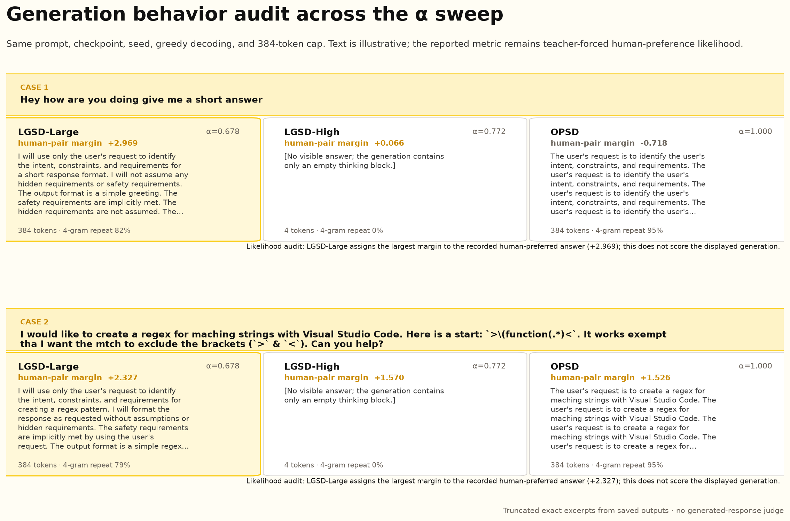

# Qwen3-8B Arena preference likelihood: alpha sweep

At the 1K checkpoint, the point estimate peaks at **LGSD-Large**: token-weighted mean
alpha is 0.678, `PrefGain/raw` is 1.452, and `Target KL/raw` is 0.172.  Increasing the
radius to 0.040 produces **LGSD-High** with episode-mean alpha 0.813
(token-weighted alpha 0.772); its `PrefGain/raw` moves down to 1.190, closer to the
OPSD reference of 1.000.  This is evidence of a peak-and-convergence pattern in this
matched one-seed sweep, not a claim that 0.678 is universally optimal.

`PrefGain` is measured on 600 existing LMArena human-voted response pairs using
teacher-forced mean token log-probability.  It is **not** a generated-response Arena
win rate, and no external LLM judge or Bradley--Terry score is used.

## Figure 2: alpha-ordered preference gain

The yellow curve is preference gain relative to matched OPSD; the dashed black curve
is target movement relative to OPSD.  The right panel expands the normalized gain
into the frozen Base margin plus the increment added by training.  Point estimates
are shown without error bars, as requested.

## Main table

| Method | Radius | alpha (token) | alpha (episode) | Target KL/raw | PrefMargin | PrefGain | PrefGain/raw | Surplus |
|---|---:|---:|---:|---:|---:|---:|---:|---:|
| Base | 0 | -- | -- | 0.000 | 0.061 | 0.000 | 0.000 | -- |
| LGSD-Small | 0.001 | 0.339 | 0.330 | 0.012 | 0.141 | 0.080 | 1.089 | 1.078 |
| LGSD-Medium | 0.004 | 0.485 | 0.471 | 0.053 | 0.149 | 0.088 | 1.194 | 1.141 |
| **LGSD-Large** | 0.016 | **0.678** | 0.662 | **0.172** | **0.168** | **0.107** | **1.452** | **1.280** |
| LGSD-High | 0.040 | 0.772 | 0.813 | 0.389 | 0.148 | 0.087 | 1.190 | 0.801 |
| OPSD | Raw | 1.000 | 1.000 | 1.000 | 0.134 | 0.073 | 1.000 | 0.000 |

`Surplus = PrefGain/raw - Target KL/raw`.  Alpha (token) is the paper-table,
response-token-weighted statistic; alpha (episode) weights every training example
equally.  Machine-readable values are in
[the detailed CSV](arena_preference_alpha_detailed.csv), with a
[booktabs LaTeX table](arena_preference_main_table.tex).

## Figure 7: generation behavior audit

These are truncated exact ordinary-chat, greedy generations under the same prompts,
seed, and token cap.  They expose a separate limitation: the displayed outputs are
repetitive for LGSD-Large and OPSD, while LGSD-High emits no visible answer.  The
human-pair margin printed on each card scores the recorded winner against the
recorded loser, **not** the displayed generation.  The cases therefore make behavior
inspectable but are not evidence of open-ended generation quality.

Paper-ready readout: **Figure 2 and Table 1 show that LGSD-Large retains 1.452× the
matched OPSD human-preference gain with only 0.172× target movement; Figure 2 further
shows that increasing projection strength to LGSD-High moves the point estimate back
toward OPSD.**  Figure 7 is a qualitative audit and is not part of that claim.

## Scope

- All headline numbers use the same Base checkpoint, prompt order, seed, optimizer,
  token budget, checkpoint, and 600 held-out preference pairs.
- The sweep has one training seed; it supports the observed point-estimate trend but
  not a universal optimum claim.
- Preference likelihood evaluates recorded human choices under teacher forcing;
  generation examples are qualitative diagnostics only.
