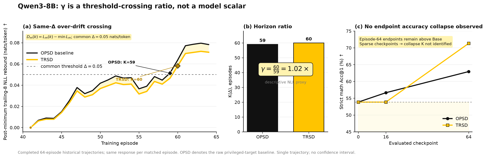

# Qwen3-8B stability-horizon γ probe



## Result

The strict accuracy-collapse ratio is **not identified** by these 64-episode logs: strict Acc@1 was evaluated only at Base, episode 16, and episode 64. Both episode-64 endpoints remain above the Base accuracy (53.85%), with OPSD at 62.94% and TRSD at 71.33%. These sparse checkpoints neither show an endpoint collapse nor resolve a possible crossing and recovery between checkpoints, so their first-crossing ratio cannot be reduced to a finite point estimate.

For the explicitly declared over-drift proxy, set Δ=0.05 nats/token on each method's trailing-8 common-response NLL rebound from its own post-warmup minimum. The observed crossings are

\[
K_{\mathrm{OPSD}}=59,\qquad
K_{\mathrm{TRSD}}=60,\qquad
\gamma_{\mathrm{NLL}}=\frac{60}{59}=1.0169\approx 1.02\times.
\]

This means TRSD delays this particular measured NLL-rebound crossing by one episode. Across the finite, observed threshold sweep with Δ in [0.02, 0.07], γ ranges from 1.00× to 1.15×; larger thresholds become right-censored for TRSD. This sensitivity is why γ must always be reported together with Δ and the drift metric.

## Estimand

For method \(m\), let \(L_m(k)\) be the trailing-8 NLL at episode \(k\), let \(k_m^*\) be its minimum over observed episodes 8–64, and define

\[
K_m(\Delta)=\min\{k\ge k_m^*:L_m(k)-L_m(k_m^*)\ge\Delta\}.
\]

The primary probe uses Δ=0.05. OPSD's minimum is 0.105194 at episode 41 and its absolute crossing level is 0.155194; TRSD's minimum is 0.099121 at episode 41 and its crossing level is 0.149121.

## Scope and limitations

- `OPSD` in this figure denotes the repository's raw privileged-target baseline (`Privilege-SD` in the source tables), not a new 64-episode run of the official generalized-JSD implementation.
- The NLL comparison uses the same ordinary OPSD response for both methods at each matched episode, but the response changes across episodes. The trailing window reduces query-level noise but does not turn this into a fixed held-out probe set.
- The historical source trajectories have different rollout-token caps (OPSD 4,096; TRSD 10,240). The same-sequence scoring removes response mismatch at a given episode, but it does not remove this training-protocol confound.
- This is one deterministic 64-episode trajectory per method. The threshold sensitivity table is descriptive and is not a confidence interval.
- Strict accuracy is available only at Base, episode 16, and episode 64, so an accuracy first-crossing time is not identifiable from these checkpoints.
- The newer L40S conservative-control runs were still incomplete when this bundle was generated and are not mixed into the estimate.

## Claim–evidence map

- **Claim:** no accuracy-collapse γ is identified through episode 64. **Evidence:** only Base/16/64 strict Acc@1 checkpoints are available; both episode-64 endpoints exceed Base. **Status:** supported; crossings between checkpoints are unresolved.
- **Claim:** the declared NLL proxy gives γ≈1.02×. **Evidence:** first post-minimum crossings at episodes 59 and 60 under Δ=0.05. **Status:** descriptively supported for this metric and threshold.
- **Claim:** γ is threshold-dependent. **Evidence:** `gamma_threshold_sensitivity.csv`. **Status:** supported; no threshold-free scalar claim is permitted.

## Reproduce

```bash
/home/da839/.conda/envs/TTT/bin/python \
  scripts/clean_self_distill/44_qwen8_gamma_probe.py
```
