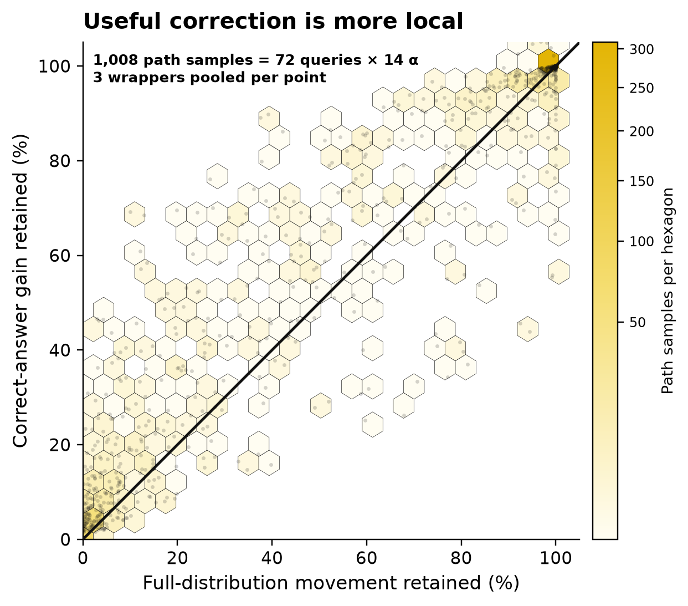
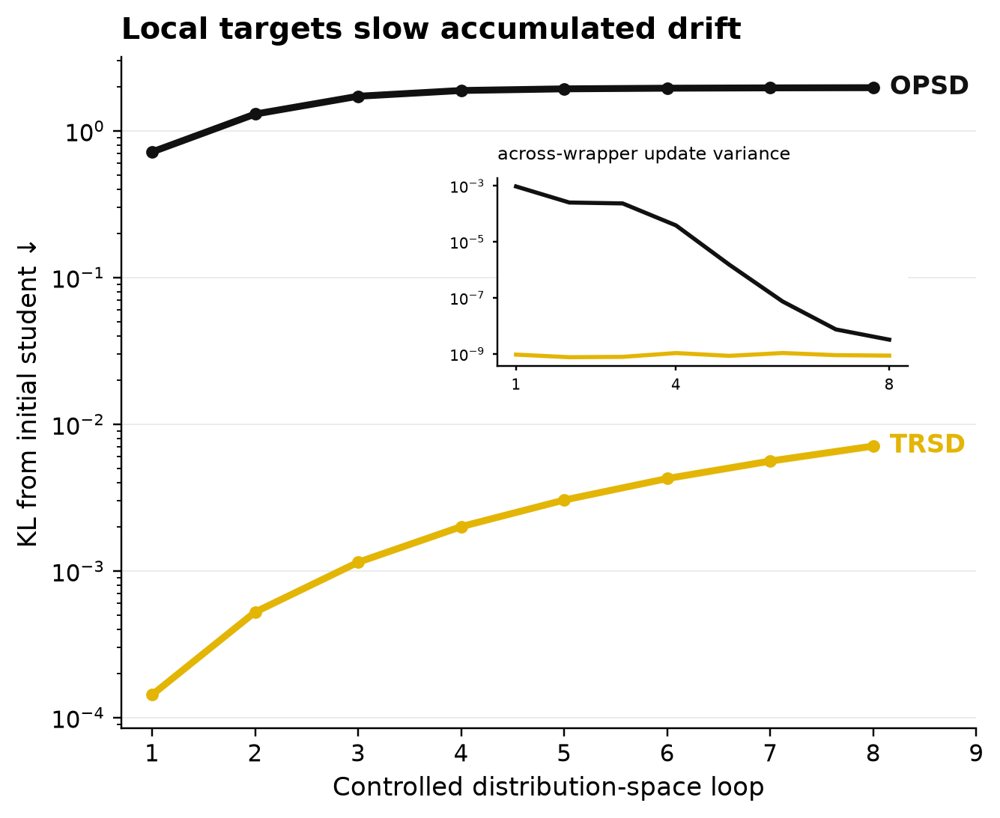
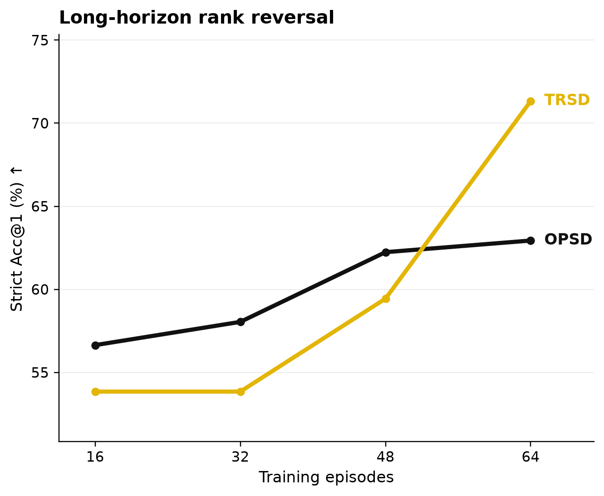

# Locality-hypothesis empirical chain

Frozen Qwen3-8B Study 1: 72 held-out verified-CoT positive controls, three prompt wrappers, exact full-vocabulary scoring, and no parameter update.

## Result

At the pre-specified TRSD radius $\epsilon=0.004$, the projected point retains **11.4%** of full privileged useful-answer fidelity while retaining **5.2%** of full-distribution TV movement.  Useful-answer fidelity is the retained fraction of the verified-answer log-probability gain, not a claim that every other distributional change is nuisance.

Across eight controlled loops, local targets end at 0.0036x the raw-target deviation.  Wrapper sensitivity is 0.000491% of raw when averaged over loops; raw sensitivity spikes at the first loop rather than increasing monotonically.

In the historical matched-horizon Qwen3-8B evaluation, TRSD-minus-OPSD changes from -2.80 points at 16 episodes to +8.39 points at 64 episodes.  This is downstream long-horizon behavior, not a projection-only causal ablation.

## Study 1 construction

For each query and wrapper, `q_alpha = softmax((1-alpha) z_student + alpha z_privileged)`.  Define `G_i(alpha) = average_[wrapper,answer-token] [log q_alpha(gold token) - log p_student(gold token)]` and `M_i(alpha) = average_[wrapper,answer-token] TV(q_alpha,p_student)`.  The plot uses `x_i(alpha) = 100 M_i(alpha)/M_i(1)` and `y_i(alpha) = 100 G_i(alpha)/G_i(1)`.  Thus each of 72 queries contributes 14 points after its three wrappers are pooled, for 1,008 plotted path samples backed by 3,024 query-wrapper-path evaluations.

## Figure caption

**Locality hypothesis and its empirical consequences.** Study 1: the hexbin landscape includes all 1,008 fixed-path samples, with every raw point overlaid; darker hexagons contain more samples.  The horizontal coordinate is endpoint-normalized full-vocabulary TV movement and the vertical coordinate is endpoint-normalized verified-answer log-probability gain; the black diagonal denotes equal retention. Study 2: raw privileged targets rapidly leave the student neighborhood in controlled distribution-space loops, while KL-bounded local targets accumulate deviation slowly; the inset is across-wrapper variance of per-loop update KL. This does not assume nuisance-free supervision: it measures that context-specific variation cannot enter arbitrarily strongly in one bounded update and therefore accumulates more slowly. Study 3: on the frozen 143-question strict-Acc@1 evaluation, raw/direct OPSD is stronger early, whereas TRSD is stronger at the 64-episode horizon.

## Scope

- Study 1 is an oracle positive-control mechanism diagnostic because the privileged prompts contain verified derivations and final answers.
- Pairwise wrapper TV is retained in `summary.json` as a secondary diagnostic, but it is nonmonotone along the fixed-alpha path and is not used for the headline locality claim; wrapper robustness is tested by the filtered-loop estimand in Study 2.
- Study 2 is distribution-space simulation with no optimizer step.
- Study 3 reuses completed training/evaluation logs and supports a horizon association, not projection-only causality.
