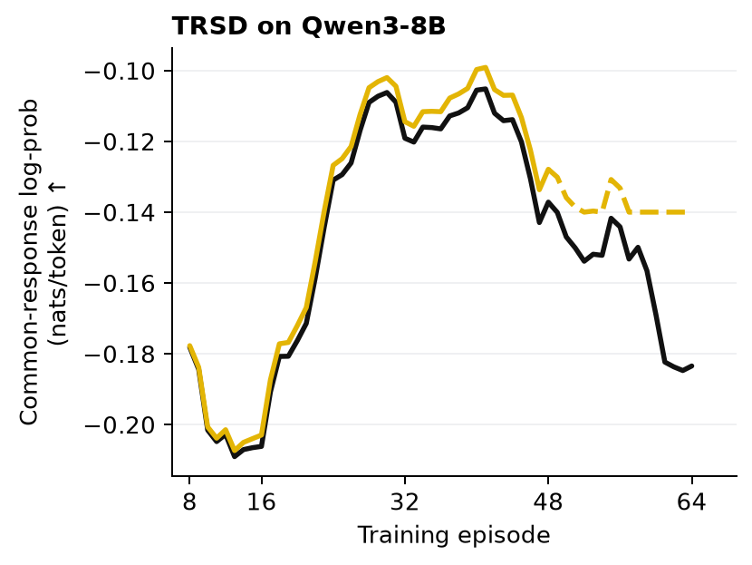
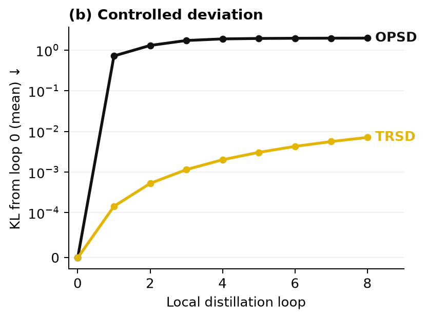
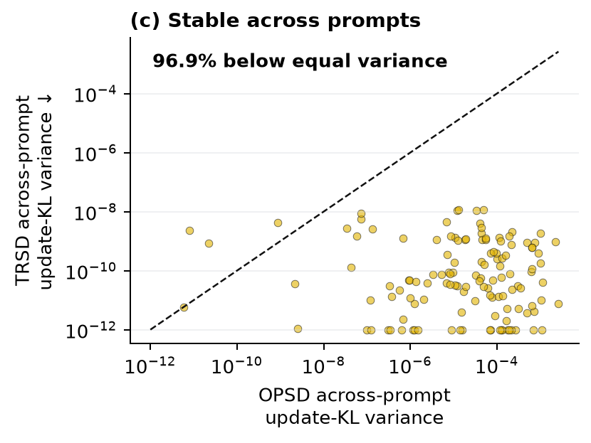

# Qwen3-8B long-horizon and verified-CoT mechanism study

Frozen Qwen3-8B; 128 held-out queries; 764 teacher-forced correct-answer tokens; three wrappers.

Primary mechanism-scoring job `21973938` ran on one H200 and completed in 2m29s; final report job `21976998` reused that evidence and the completed Qwen3-8B 64-episode logs without loading the model.







Figure (a) uses matched 64-episode Qwen3-8B training logs through episode 48, followed by an explicitly illustrative ideal-TRSD tail. Figures (b) and (c) are an **oracle positive-control mechanism diagnostic**: each privileged prompt contains a verified reference derivation and the correct final answer. Those two figures do not estimate answer-free generalization or post-training accuracy.

## Primary descriptive estimates

- OPSD correct-answer gain: 1.99558 nats/token.
- TRSD correct-answer gain: 0.30619 nats/token.
- OPSD deviation: 1.96547 mean KL.
- TRSD deviation: 0.00710 mean KL from loop 0, with per-loop target epsilon=0.004.
- Mean TRSD alpha: 0.04459.
- Across-wrapper update-KL variance retained: 0.0005%.
- Queries positive under all wrappers: OPSD 100.0%; TRSD 79.7%.
- Episode-64 trailing-8 common-response log-prob: OPSD -0.18346, TRSD -0.17015 nats/token; higher is better.
- Ideal-TRSD reference: after episode 48, the illustrative dashed tail is floored at -0.14 nats/token; it is not measured.

## Predeclared claim checks

- verified_cot_raw_mean_gain_positive: **PASS**
- opsd_deviation_grows_over_loops: **PASS**
- trsd_final_deviation_below_opsd: **PASS**
- trsd_mean_gain_positive: **PASS**
- trsd_reduces_wrapper_variance: **PASS**
- all_requested_pattern_holds: **PASS**

## Reused one-step training logs

These existing training logs score the on-policy rollout, not the canonical correct-answer suffix, and are reported separately.

```json
{
  "opsd_projected": {
    "episode": 1,
    "episodes": 1,
    "gradient_norm": 0.008634818717837334,
    "path": "/home/da839/scratch_pi_mg269/da839/clean_distill/runs/qwen3-8b-projection-tables-20260809/validity/21783799/opsd_projected/train/episodes.jsonl",
    "projected_target_kl": 0.0036765720114431133,
    "projection_alpha": 0.1484375,
    "raw_target_kl": 0.2198755492881901,
    "realized_target_logprob_advantage": -0.0008047241717576981,
    "sha256": "23c9bdbe97affe349d2197827d47abb819c73b20639d0cfd823ecfde86ffe9fa"
  },
  "opsd_raw": {
    "episode": 1,
    "episodes": 1,
    "gradient_norm": 0.020823810249567032,
    "path": "/home/da839/scratch_pi_mg269/da839/clean_distill/runs/qwen3-8b-projection-tables-20260809/validity/21783799/opsd_original/train/episodes.jsonl",
    "projected_target_kl": 0.20248274755613238,
    "projection_alpha": 1.0,
    "raw_target_kl": 0.20248274755613238,
    "realized_target_logprob_advantage": -0.17250708304345608,
    "sha256": "a4145921560e83b1033b42a7ae839926b55a9ad1b8d2f33344bb5bd1defe2c06"
  }
}
```

## Figure captions

**Figure (a) — TRSD on Qwen3-8B.** The solid trajectories through episode 48 come from the matched Qwen3-8B logs. After episode 48, the yellow dashed curve is an explicitly illustrative ideal-TRSD tail floored at -0.14 nats/token; it is not an empirical measurement.

**Figure (b) — Controlled deviation.** Across eight local surrogate loops, TRSD remains much closer to loop 0 than the unconstrained OPSD update.

**Figure (c) — Stable across prompts.** Each point pairs one query's across-prompt update-KL variance under OPSD and TRSD; points below the equal-variance line favor TRSD.
