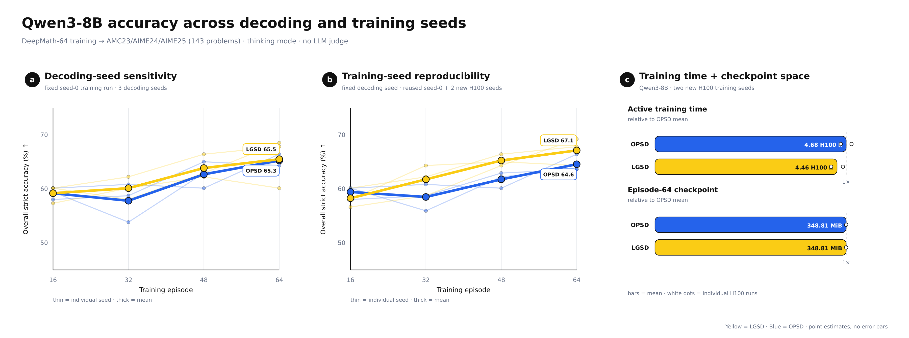
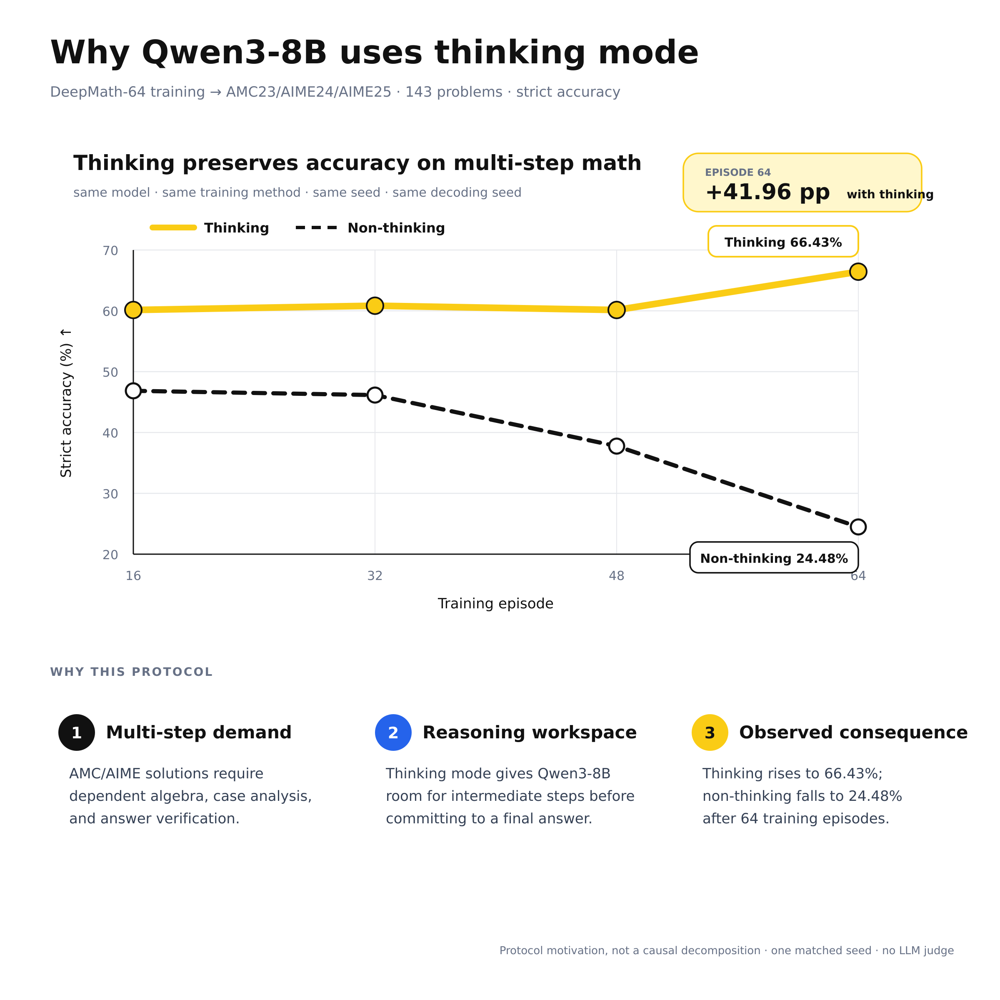
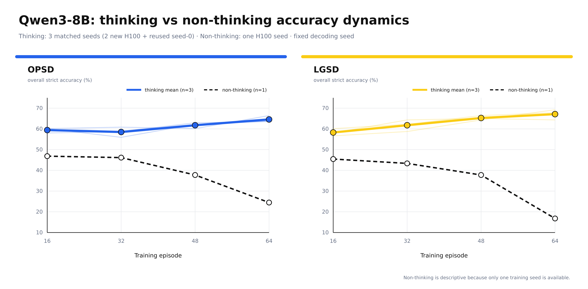

# Qwen3-8B: accuracy across training seeds, decoding seeds, and thinking modes

Qwen3-8B was trained for 64 DeepMath episodes and evaluated without an LLM
judge on the fixed 143-problem AMC23/AIME24/AIME25 set. Accuracy is strict
answer accuracy, `correct / 143`, with a 10,240-token generation cap. Yellow is
LGSD (`TRSD` in older logs), blue is OPSD, thin lines are individual seeds, and
thick lines are arithmetic means. Episodes 16, 32, 48, and 64 are plotted; the
nominal episode-0 adapters are omitted because no method-specific update has
occurred there and repeated stochastic inference is not identical.

## Main result: three randomized training seeds

The training-seed comparison fixes decoding seed `20260820`. It uses the saved
seed-0 run plus two new independent H100 runs with seeds `1479179816` and
`1266198024`.

All three runs reuse the same ordered 64-example DeepMath manifest. The run seed
changes stochastic training/rollout choices, but **sample order is fixed**. This
experiment therefore tests reproducibility across three run seeds for Qwen3-8B;
it does not test robustness to data ordering and it does not establish the same
claim for the other backbones.

| Episode | OPSD accuracy | LGSD accuracy | LGSD − OPSD |
|---:|---:|---:|---:|
| 16 | **59.44%** | 58.28% | −1.17 pp |
| 32 | 58.51% | **61.77%** | +3.26 pp |
| 48 | 61.77% | **65.27%** | +3.50 pp |
| 64 | 64.57% | **67.13%** | **+2.56 pp** |

At episode 64, LGSD beats its matched OPSD run for all three training seeds:
`67.83 vs 66.43`, `64.34 vs 63.64`, and `69.23 vs 63.64` percent. The supported
claim is therefore that LGSD's late-training accuracy advantage reproduces
across these three training seeds. LGSD starts 1.17 points lower at episode 16,
so the data do not support an across-the-board advantage at every checkpoint.

## Decoding-seed sensitivity

This comparison fixes the seed-0 trained checkpoints and changes only the
decoding seed (`20260819`, `20260820`, and `20260821`).

| Episode | OPSD mean | LGSD mean | LGSD − OPSD |
|---:|---:|---:|---:|
| 16 | 59.21% | 59.21% | 0.00 pp |
| 32 | 57.81% | **60.14%** | +2.33 pp |
| 48 | 62.70% | **63.87%** | +1.17 pp |
| 64 | 65.27% | **65.50%** | +0.23 pp |

The episode-64 results by decoding seed are:

| Decoding seed | OPSD | LGSD | LGSD − OPSD |
|---:|---:|---:|---:|
| 20260819 | 65.03% | **68.53%** | +3.50 pp |
| 20260820 | 66.43% | **67.83%** | +1.40 pp |
| 20260821 | **64.34%** | 60.14% | −4.20 pp |

The final mean is effectively tied: LGSD leads by only 0.23 points. Moreover,
LGSD has a 4.66-point sample standard deviation across decoding seeds versus
1.07 points for OPSD. Thus this experiment does **not** establish better
decoding stability for LGSD; its positive and negative decoding-seed outcomes
largely cancel. The training-seed result above is the cleaner positive result.

## Thinking versus non-thinking

### Why thinking mode (single-method view)

Holding the model, training method, training seed, and decoding seed fixed,
thinking mode reaches 66.43% at episode 64 while non-thinking reaches 24.48%.
The square presentation figure therefore motivates thinking mode as the matched
protocol for multi-step math; it is not presented as a causal decomposition.

### Full method comparison

With thinking enabled, the three-seed episode-64 means are 64.57% for OPSD and
67.13% for LGSD. The single non-thinking run falls to 24.48% and 16.78%,
respectively. In the seed-0 comparison, the thinking endpoints are 66.43% for
OPSD and 67.83% for LGSD. This is strong evidence that the DeepMath setup is
sensitive to the thinking protocol, but the non-thinking curve is descriptive
because only one training seed is available. It should not be presented as a
multi-seed method ranking.

## Time and checkpoint space

The cost panel uses only the two new, hardware-matched one-H100 training seeds.
Mean active training time is 4.68 H100-hours for OPSD and 4.46 H100-hours for
LGSD. Both episode-64 checkpoints are 348.81 MiB, and peak allocated memory is
approximately 22.34 GiB per run. These are observed costs, not theoretical
complexity claims.

## Reproduction and scope

- `all_accuracy_runs.csv` contains all 60 scored configurations.
- `training_seed_accuracy.csv`, `decoding_seed_accuracy.csv`, and
  `thinking_mode_accuracy.csv` are the plotted accuracy inputs.
- `resource_cost.csv` contains the two-by-two H100 cost audit.
- `collect_results.py` rebuilds the CSV files from scored outputs;
  `build_figures.py` regenerates the multi-panel figures, and
  `build_why_thinking_square.py` regenerates the square thinking-mode figure.
- The evaluation uses no external LLM judge, blinded judge, Bradley–Terry fit,
  or Arena win-rate claim.
- No GRPO-PRM or SRPO result is included in this report.
