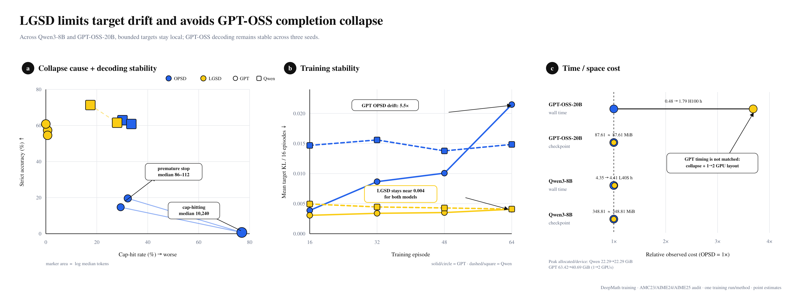

# Stability, collapse, and cost across Qwen3-8B and GPT-OSS-20B

This triptych uses yellow for LGSD, blue for OPSD, and black for references. Logs
named `TRSD` are relabeled `LGSD`. All models are trained on DeepMath; the decoding
audit uses AMC23, AIME24, and AIME25.

## What each panel computes

**Panel A — collapse cause and decoding stability.** Every marker is one episode-64
evaluation run. Its x coordinate is the fraction of 143 responses hitting the
10,240-token cap, its y coordinate is strict accuracy, and its area scales with the
log median response length. GPT-OSS-20B uses three randomized decoding seeds. Qwen3-8B
uses the two saved inference repeats available now, so its spread is descriptive and
is not presented as a registered three-seed estimate. GPT OPSD alternates between a
cap-hitting mode (76.9% cap hits; 10,240-token median) and prematurely short modes
(86–112-token medians), while GPT LGSD stays at 54.5–60.8% accuracy with at most 0.7%
cap hits. Qwen does not show a collapse of that scale in either saved repeat; its LGSD
runs have lower cap-hit rates than OPSD, although the two-run LGSD accuracy spread is
larger.

**Panel B — training stability.** Each value is mean teacher–student Target KL within
a non-overlapping 16-episode window. At episodes 49–64, GPT OPSD reaches 0.02148 versus
0.00407 for LGSD, and Qwen OPSD reaches 0.01485 versus 0.00410 for LGSD. Thus the
bounded LGSD target remains near 0.004 on both model families, while the unrestricted
target is larger and, for GPT-OSS-20B, grows sharply before collapse.

**Panel C — time and space cost.** The x coordinate is an observed cost divided by the
same-model OPSD cost. Active wall time is summed from episode journals; checkpoint
storage is the full episode-64 checkpoint directory. In the matched Qwen L40S audit,
LGSD takes 4.41 h versus 4.35 h for OPSD and has the same 348.81 MiB checkpoint. For
GPT, LGSD takes 1.79 h versus 0.48 h for the collapsed OPSD run, while both checkpoints
are 87.61 MiB. This GPT time difference is not pure algorithmic overhead: OPSD emits
far fewer tokens after collapse, and the completed OPSD/LGSD runs used one/two H100s,
respectively. Peak allocated memory per observed device is included in the CSV but is
not used as a cross-hardware headline.

## Paper-safe readout

Across Qwen3-8B and GPT-OSS-20B, LGSD keeps the training target substantially more
local. On GPT-OSS-20B, this accompanies far more stable completion behavior across
three decoding seeds; neither the premature-stop nor cap-hitting collapse mode appears
in the evaluated LGSD runs.
The method does not add checkpoint storage; observed time depends strongly on the
length of the generated training trajectories and the hardware layout.

## Scope

- One completed training run per model and method is used; this is not a
  multi-training-seed claim.
- Qwen decoding stability currently has two saved repeats, whereas GPT has three
  explicitly randomized decoding seeds.
- Panel B establishes an association between target locality and collapse mitigation,
  not proof that Target KL is the only causal mechanism.
- No external LLM judge or Bradley–Terry score is used.

Machine-readable inputs are `panel_a_decoding_runs.csv`,
`panel_b_training_stability.csv`, and `panel_c_resource_cost.csv`. Source hashes and
protocol caveats are recorded in `provenance.json`; the figure is regenerated by
`build_triptych.py`.
