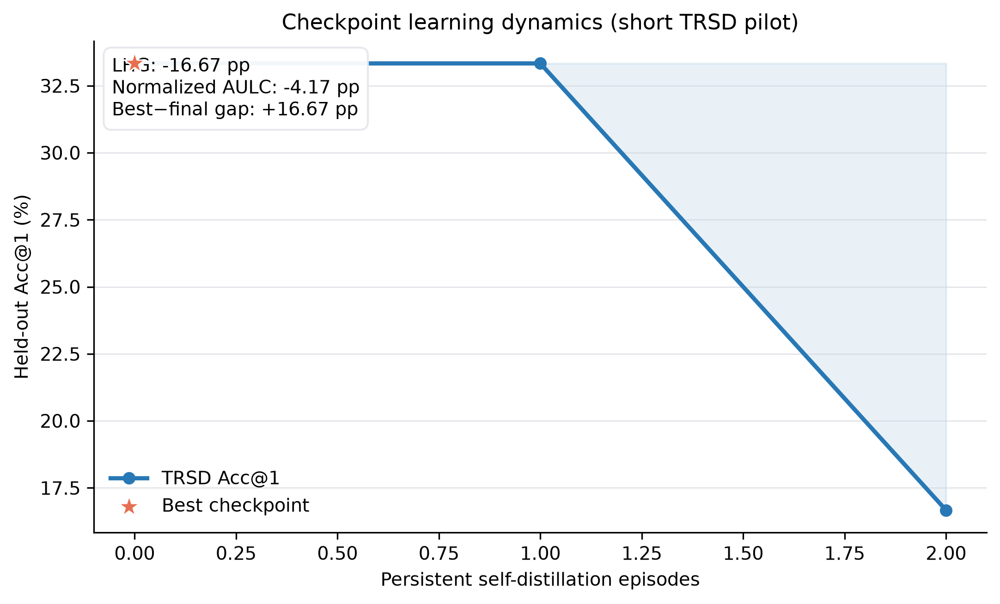
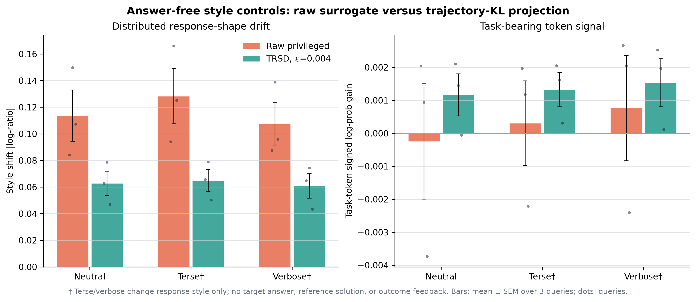
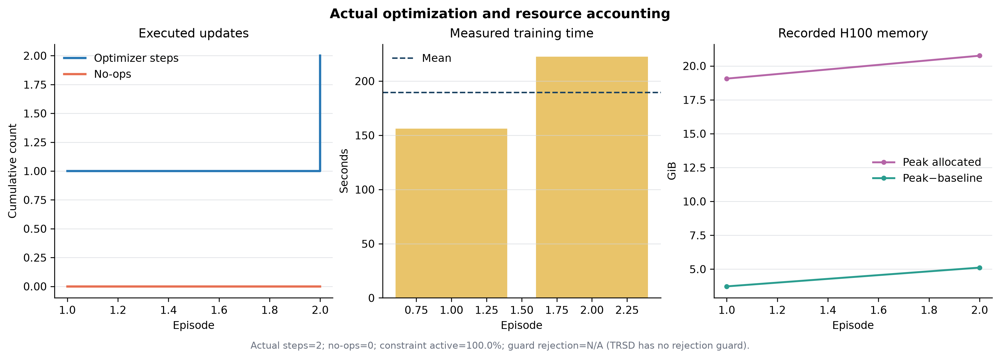

# Short TRSD empirical report

All values below are recomputed from recorded JSONL artifacts. Missing measurements
are reported as **N/A**; no result is imputed. The accepted training journal is
restricted to `trsd:exponential_teacher_projection`, so legacy probe/ridge results cannot enter this report.

## Checkpoint learning dynamics (short pilot)

| Checkpoints | Baseline Acc@1 | Final Acc@1 | LHG | Normalized AULC | Best−final gap |
|---:|---:|---:|---:|---:|---:|
| 3 | 33.33% | 16.67% | -16.67 pp | -4.17 pp | +16.67 pp |

`LHG = final − first`. Normalized AULC is trapezoidal area of the Acc@1 gain
over the observed episode axis, divided by the observed episode span. Best−final
gap is `max(checkpoint Acc@1) − final Acc@1`.

## Answer-free style controls

| Queries | Projection epsilon | Raw style shift | Projected style shift | Style retention | Raw task gain | Projected task gain | Task retention |
|---:|---:|---:|---:|---:|---:|---:|---:|
| 3 | 0.004 | 0.11655 | 0.06288 | 54.0% | 0.00028 | 0.00134 | 484.8% |

Neutral, terse, and verbose wrappers are answer-free. Terse and verbose are
explicit **style-only controls**: they contain no target answer, reference
solution, future trajectory, or post-outcome feedback. Bars are query means with
SEM; individual dots are the recorded query values.

## Actual optimization and resource accounting

| Episodes | Optimizer steps | No-ops | Train time | Mean sec/episode | Max peak allocated | Max peak delta | Constraint active | Guard rejection |
|---:|---:|---:|---:|---:|---:|---:|---:|---:|
| 2 | 2 | 0 | 379.3 s | 189.63 | 20.76 GiB | 5.11 GiB | 100.0% | N/A |

Guard rejection is N/A by design: current TRSD applies a trajectory-level KL
projection and has no proposal/update rejection guard. `optimizer_step` and no-op
counts are read directly from the episode journal.

## Machine-readable artifacts

- `checkpoint_curve.csv`
- `checkpoint_source_accuracy.csv`
- `mechanism_query_wrapper.csv`
- `mechanism_wrapper_summary.csv`
- `training_episode_resources.csv`
- `training_summary.csv`
- `summary.json`
