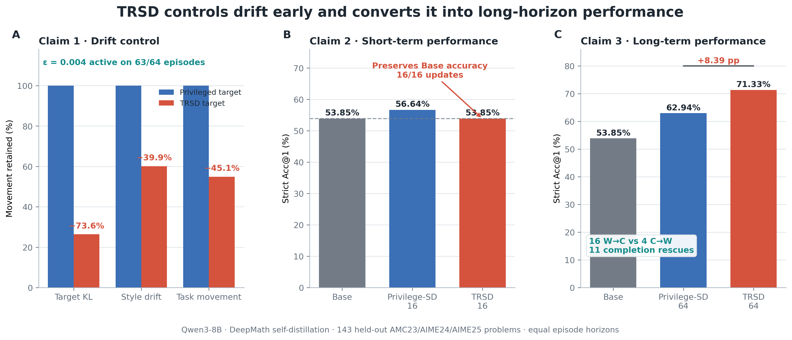
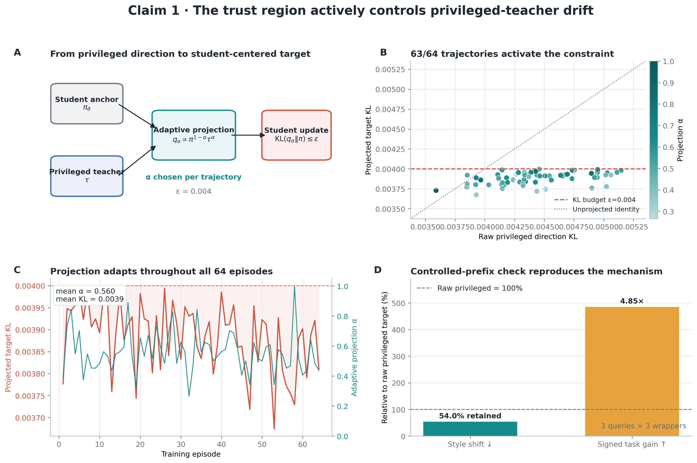
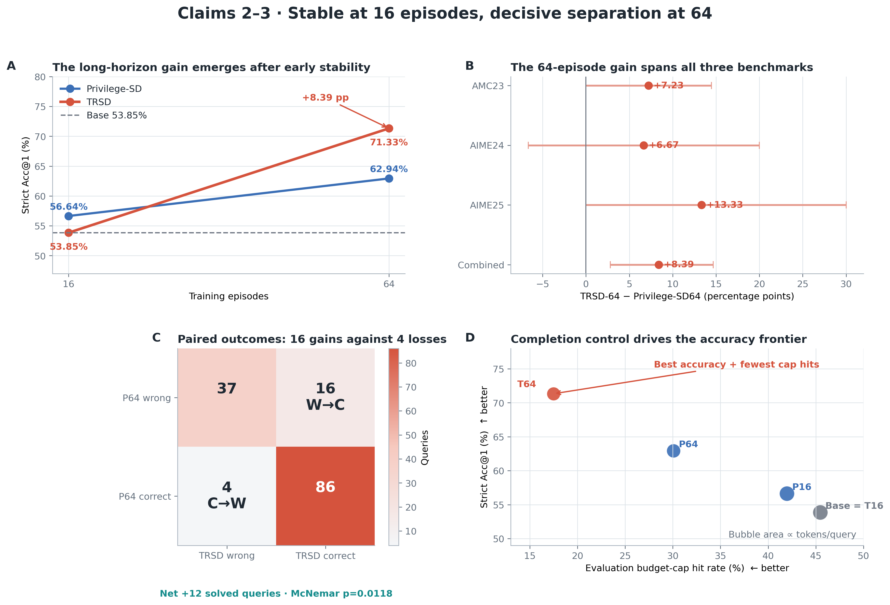

# TRSD figure story

The paper is organized around three claims: **drift control**, **short-term performance**, and **long-term performance**. The visual sequence follows the same causal narrative: constrain the privileged update, preserve the early student, then accumulate a stronger long-horizon policy.

## Figure 1 — Three-claim overview

Use this as the main teaser or first experiment figure. Panel A shows that projection retains 26.36% of raw target KL and 60.12% of measured style movement, with the constraint active on 63/64 episodes. Panel B shows short-term stability: TRSD-16 matches Base at 53.85% after completing 16/16 updates. Panel C delivers the endpoint: at the equal 64-episode horizon, TRSD-64 reaches 71.33%, leading Privilege-SD64 by 8.39 points and Base by 17.48 points.

**Caption.** *TRSD controls privileged-teacher drift early and converts the controlled updates into long-horizon performance. At 16 episodes, TRSD preserves the Qwen3-8B base accuracy. At the matched 64-episode horizon, TRSD reaches 71.33% strict Acc@1, 8.39 points above Privilege-SD64 and 17.48 points above Base.*

## Figure 2 — Drift mechanism

Use this in the method analysis. Panel A ties the exponential projection directly to the student-centered KL budget. Panels B–C show that the trust region is operational and adaptive on the complete 64-episode trajectory. Panel D reproduces the mechanism with identical prefixes: style shift contracts to 54.0% of the raw target while signed task-token gain rises 4.85×.

**Caption.** *The trajectory-level trust region actively projects the privileged direction. The KL constraint activates on 63/64 episodes, mean projection strength is α=0.560, and the projected target remains near ε=0.004 throughout training. A controlled-prefix test reproduces lower style shift together with larger signed task-token gain.*

## Figure 3 — Performance anatomy

Use this as the main result analysis. Panel A connects the 16- and 64-episode checkpoints. Panel B shows positive T64−P64 gains on AMC23, AIME24, and AIME25. Panel C exposes the paired transition matrix: 16 wrong-to-correct moves against 4 correct-to-wrong moves. Panel D shows the accuracy/completion frontier; TRSD-64 combines the highest accuracy with the lowest cap-hit rate.

**Caption.** *TRSD is stable at 16 episodes and separates at 64. The long-horizon gain spans all three benchmarks and is strongly paired: 16 P64 errors become correct under T64, compared with 4 reverse transitions. Eleven of the sixteen favorable transitions are completion rescues, placing T64 at the best accuracy–completion point.*

Each figure is available as PNG for GitHub, vector PDF for papers, and editable SVG for slides.
