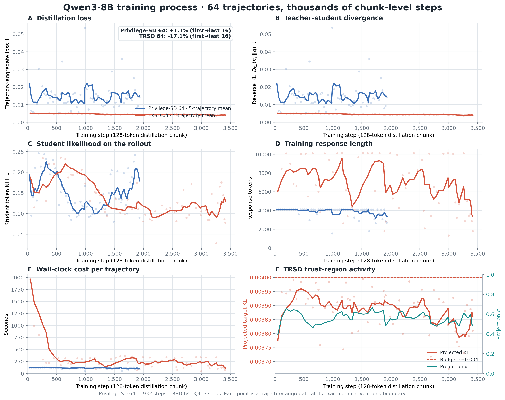
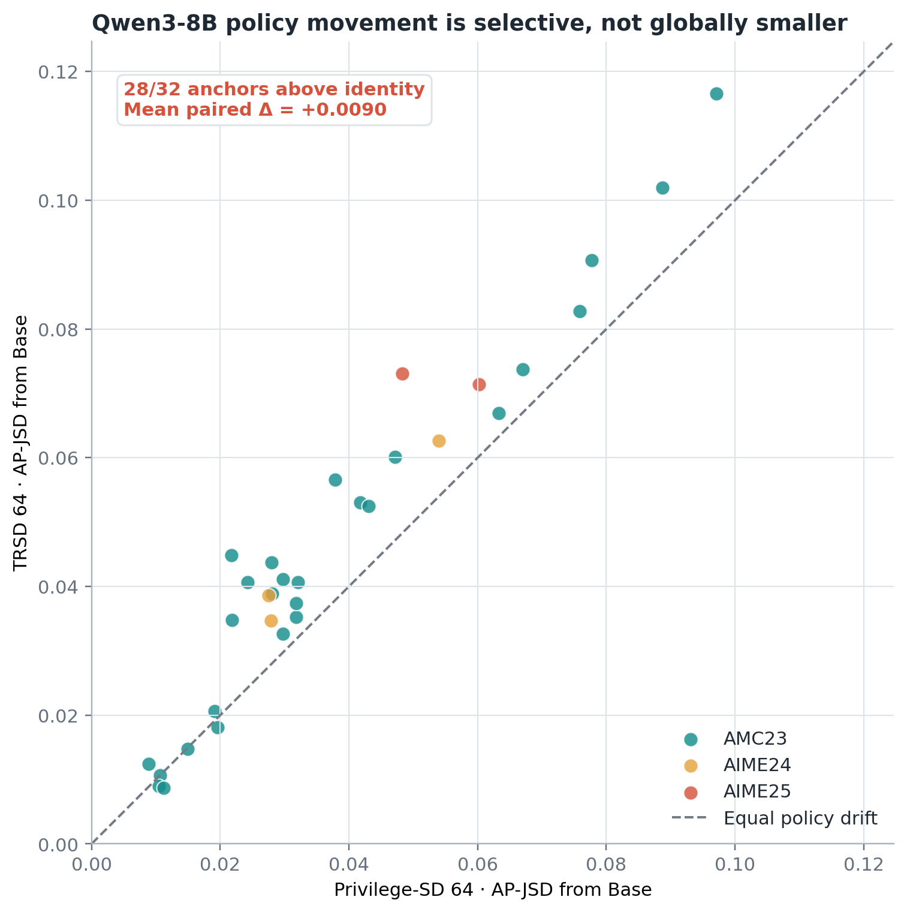
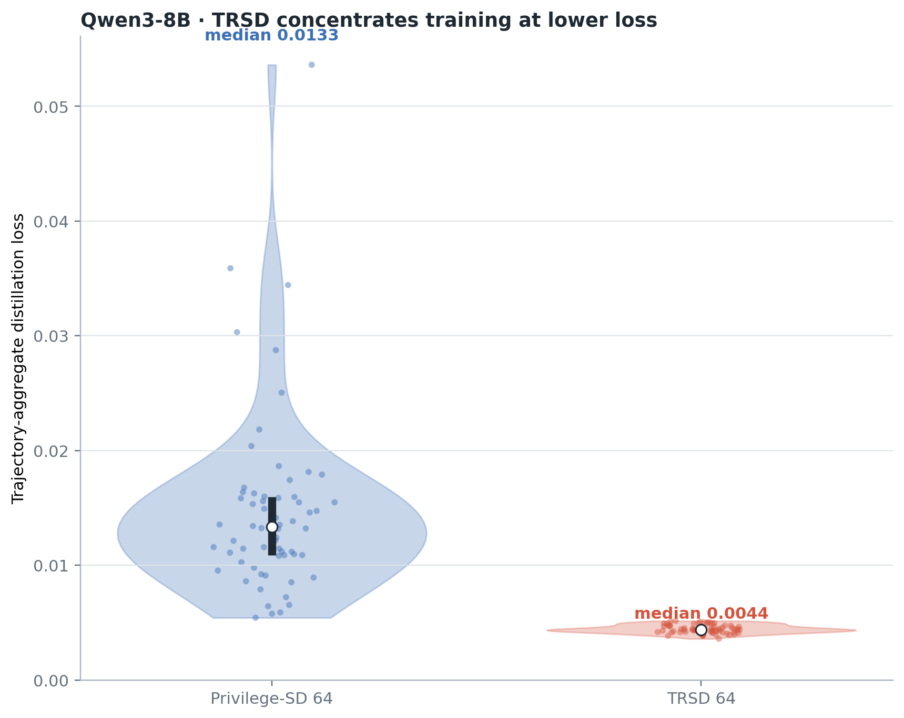
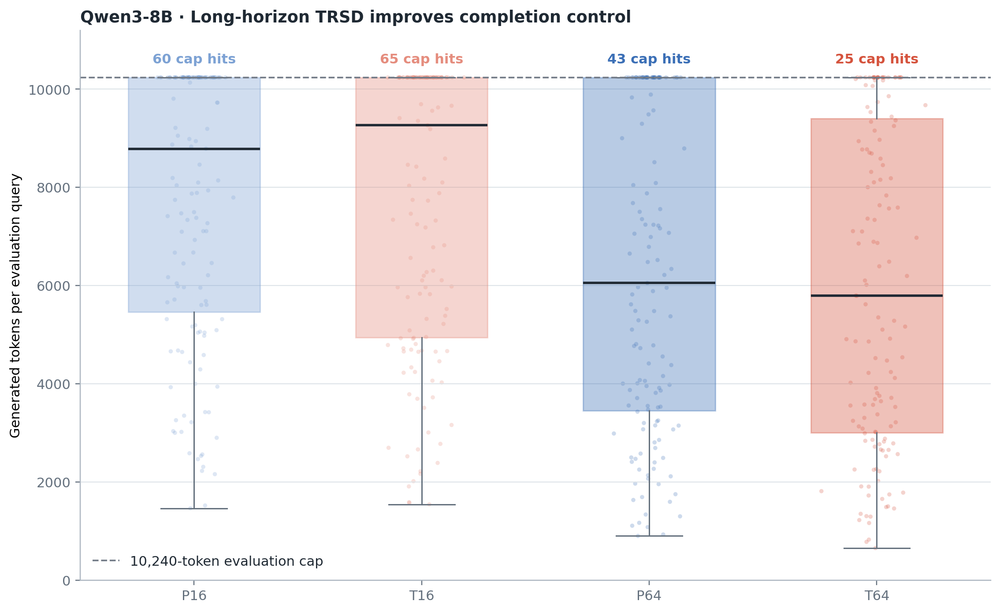
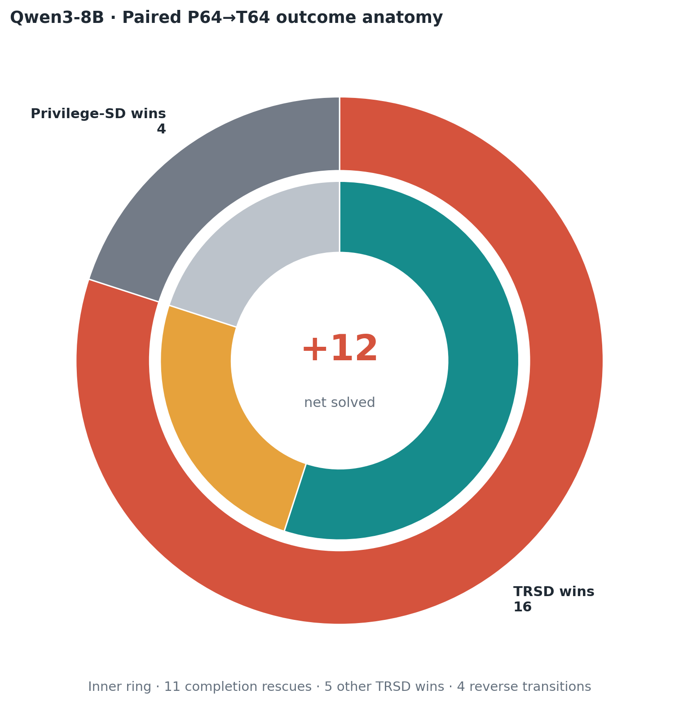
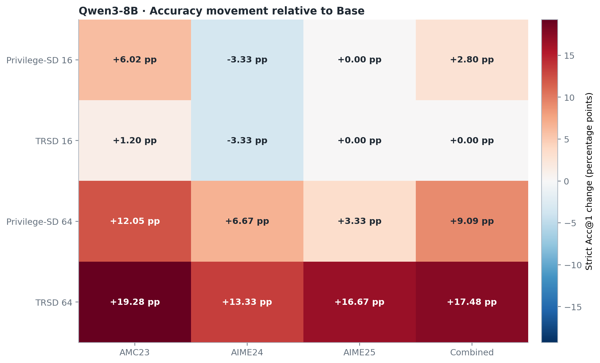

# Qwen3-8B visual suite

This suite separates **training dynamics**, **policy movement**, **distributional behavior**, **paired outcome mechanism**, and **benchmark generalization**. Every figure is backed by a machine-readable CSV in `docs/results/qwen3_8b_visual_suite/`.

## Figure 1 — Training process over detailed training steps

The x-axis is cumulative 128-token distillation chunks: **1,932 steps** for Privilege-SD and **3,413 steps** for TRSD, across 64 outer-loop trajectories each. Every marker is a trajectory aggregate placed at its exact end-of-trajectory microstep boundary. The loss panel shows the main optimization result: TRSD's last-16 mean is 17.1% below its first-16 mean, while Privilege-SD is essentially flat (+1.1%). The remaining panels connect this descent to divergence, likelihood, response length, runtime, and active trust-region projection.

**Caption.** *Qwen3-8B training dynamics over cumulative 128-token distillation microsteps. Thin markers are trajectory aggregates at exact microstep boundaries and solid curves are five-trajectory moving means. TRSD spans 3,413 chunk-level steps and reduces mean loss by 17.1% from the first to last trajectory quartile, while maintaining the projected target near ε=0.004.*

## Figure 2 — Paired AP-JSD scatter

TRSD lies above the identity line on **28/32** fixed-prefix anchors. Read jointly with the lower predefined-vocabulary drift: TRSD changes the policy more broadly while transferring fewer privileged style markers. This is selective adaptation, not blanket conservatism.

## Figure 3 — Loss violin

The violin exposes the complete 64-trajectory loss distribution rather than only a mean curve. TRSD's density is lower and tighter, showing that the training-process result is distributional rather than driven by a few late points.

## Figure 4 — Evaluation-length boxplot

The 143-query distributions show the completion mechanism. At 64 episodes, TRSD cuts evaluation cap hits from 43 to 25 while raising strict Acc@1 from 62.94% to 71.33%.

## Figure 5 — Paired-transition donut

Among the 20 queries where P64 and T64 disagree, TRSD wins 16 and loses 4. Eleven favorable transitions are completion rescues, tying the aggregate accuracy gain to an interpretable query-level mechanism.

## Figure 6 — Accuracy heatmap

The heatmap reports percentage-point change from Base on every dataset and horizon. The short horizon remains close to Base; the 64-episode TRSD branch is positive on AMC23, AIME24, AIME25, and Combined.
