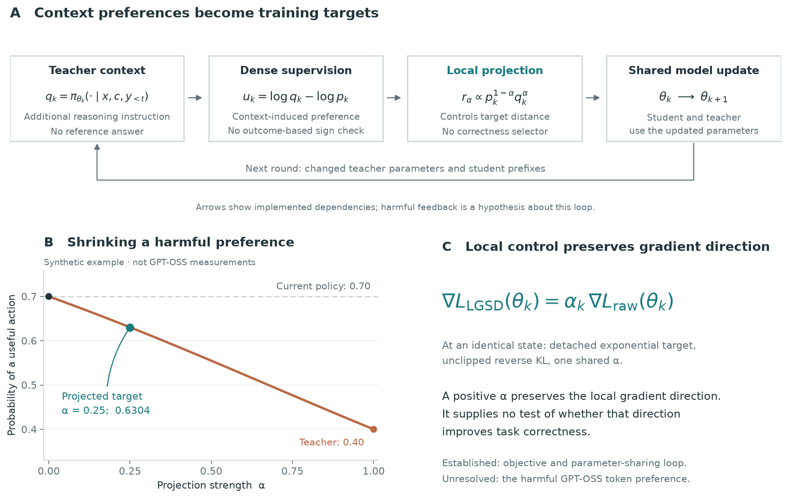

# Why privileged context can hurt—and why local projection may only slow the damage

**Privileged context changes what a model prefers to predict; it does not certify which changes improve task correctness.** Distillation transfers those preferences into the student. LGSD constrains the size of that transfer, but distance alone cannot distinguish a useful preference from a harmful one.



**Figure.** (A) Implemented flow from a teacher-only reasoning instruction to a shared-parameter update. (B) An explicitly synthetic example: interpolation attenuates a harmful teacher preference without reversing its direction. The illustrated coefficient is not a measurement or a budget-selected GPT-OSS coefficient. (C) The exact initial-gradient identity under the stated loss assumptions. The figure explains a possible failure mechanism; it does not claim to have identified the token-level cause of GPT-OSS collapse.

[Vector SVG](privileged_context_mechanism.svg) · [PDF](privileged_context_mechanism.pdf) · [Figure code](render_figure.py) · [Synthetic plot data](illustrative_target_path.csv)

> **中文要点：** privileged context 带来的 token 概率变化不天然等于正确性提升。蒸馏会学习这些变化；LGSD 缩小变化，却没有依据区分有益信号和有害偏差。如果偏差持续存在，它可以减缓负迁移，却不能仅凭局部距离约束保证纠正方向。GPT-OSS 究竟由哪种偏差主导，仍需因果验证。


## Context sensitivity is not task advantage

In this GPT-OSS run, the teacher receives an additional system instruction to decompose the problem, track constraints, check boundary cases, and consider another route. It receives no reference answer, solution, outcome feedback, or independently trained stronger model. The code calls this methodology privilege. It does not establish that the teacher is more accurate on each question or more useful at each student-generated prefix. See the [teacher prompt construction](https://github.com/XiangqiWang77/clean_distill/blob/63fd52a15d8d72cdb87536b57bcde2ab0f3a089e/src/clean_self_distill/persistent.py#L403) and the retained run's `privileged_prompt_version=predecision-reasoning-method-v1`.

For a fixed prefix $s$, write

$$
p_k(a\mid s)=\pi_{\theta_k}(a\mid x,y_{<t}),\qquad
q_k(a\mid s)=\pi_{\theta_k}(a\mid x,c,y_{<t}),\qquad
u_k(a,s)=\log q_k(a\mid s)-\log p_k(a\mid s).
$$

The likelihood ratio measures the change induced by the teacher context. Its sign does not say whether an action improves eventual correctness. A positive value can reflect useful reasoning, compliance with an instruction, a change of presentation, confidence, or another context-dependent behavior. These are possible components of the signal, not an empirically identified decomposition of this GPT-OSS run.

The exact full-vocabulary reverse-KL gradient, with the teacher detached, satisfies

$$
-\nabla_\theta D_{\rm KL}(p_\theta\Vert q_k)\big|_{\theta_k}
=\mathbb E_{a\sim p_k}\left[u_k(a,s)\nabla_\theta\log p_\theta(a\mid s)\big|_{\theta_k}\right].
$$

Thus the update reinforces relative teacher preference. It contains no verifier-derived task advantage. The problematic implication is not “information is bad”; it is the unverified assumption that a context-induced likelihood preference is an improvement direction for the task.

Even an observed increase in the teacher's overall free-generation accuracy would not establish that every conditional distribution on student-generated prefixes is a better correction target. A student prefix may contain an error or omit steps that the context-conditioned model would have generated itself. More generally, correct full trajectories do not certify the usefulness of every local imitation signal at states visited by a different policy. This is a possible source of negative transfer, not proof that prefix mismatch caused the measured GPT-OSS collapse.

## A precise criterion for harmful transfer

Let $Q_k(s,a)$ denote the true expected task outcome after action $a$, with subsequent continuation fixed to the current policy. Consider the exponential target path

$$
r_\alpha(a\mid s)\propto p_k(a\mid s)\exp\{\alpha u_k(a,s)\}.
$$

At this fixed state, the derivative of the target's expected continuation value is

$$
\left.\frac{d}{d\alpha}\mathbb E_{a\sim r_\alpha}[Q_k(s,a)]\right|_{\alpha=0}
=\operatorname{Cov}_{a\sim p_k}\left(Q_k(s,a),u_k(a,s)\right).
$$

The privilege is locally useful when its likelihood shift aligns positively with continuation value. It is locally harmful when that covariance is negative. A small target KL cannot determine this sign: the same pair of nearby distributions could increase or decrease correctness depending on which actions actually succeed. This is an exact fixed-state target-path statement, not an estimate of the actual neural optimizer's change in end-to-end performance. The covariance has not been measured in the GPT-OSS experiments.

For illustration, suppose the current policy assigns probability 0.7 to a useful action and the context-conditioned teacher assigns 0.4. Exponential interpolation with alpha 0.25 gives approximately 0.6304. Reducing alpha reduces the damage compared with copying the teacher; it does not make the teacher-directed move increase useful-action probability. The example is synthetic and does not assert that any specific GPT-OSS token has these probabilities.

## Why LGSD does not supply the missing correction

The projected target satisfies

$$
\log\frac{r_{k,\alpha}(a\mid s)}{p_k(a\mid s)}
=\alpha u_k(a,s)-\log Z_{k,\alpha}(s).
$$

The normalization term is constant across actions. Consequently, projection scales the relative preference induced by the context; it has no correctness-based rule for distinguishing useful and harmful preferences. For the implemented detached exponential target and unclipped reverse-KL loss, at the common anchor state,

$$
\nabla L_{\rm LGSD}(\theta_k)=\alpha_k\nabla L_{\rm raw}(\theta_k).
$$

A positive scalar does not reverse a harmful local gradient. Alpha zero removes that distillation signal, but does not provide a corrective signal. This identity concerns the gradient at an identical state. It does not imply identical multi-step training paths or proportional AdamW parameter updates: optimizer moments, clipping, changed rollouts, and future targets matter.

This explains why the observed GPT-OSS outcome is compatible with LGSD: if biased imitation remains in the teacher signal, local control can reduce its effect without identifying and removing its source. It would be too strong to claim that LGSD can *only ever* delay failure on every problem; adaptive scaling can change later trajectories and the balance between examples. The precise limitation is that locality alone supplies no general mechanism for correcting the sign of a task-misaligned signal.

## Why the bias can persist across self-distillation rounds

The teacher shares the evolving model parameters with the student. Its target is recomputed after training rather than supplied by an independent, frozen correctness authority. A change in student behavior changes the next rollout prefixes and also the model that scores those prefixes under the privileged instruction. There is no guarantee that this loop repairs a harmful behavioral preference; it can preserve or reinforce it. The shared-parameter dependence is established by the implementation. Self-reinforcement as the dominant cause of GPT-OSS collapse remains a hypothesis.

Observations of bounded local target KL, increasing anchored drift, or declining accuracy do not identify which context-induced preference caused the damage. Shorter outputs and lower entropy are symptoms consistent with behavioral narrowing, not proof that early termination or entropy reduction is the initiating cause.

## Direct answer for the rebuttal

> Privileged context can be harmful when the likelihood preferences it induces are misaligned with task improvement on the student's own prefixes. In our GPT-OSS setup, the privilege is an additional reasoning instruction, rather than verified outcome information, so the resulting conditional teacher distribution is not guaranteed to provide a better local target. Raw self-distillation transfers its behavioral shifts without testing their contribution to correctness. LGSD limits the magnitude of that transfer but does not identify which shifts are beneficial: with the implemented detached exponential target and reverse-KL loss, its gradient at a matched state is a positive scalar multiple of the raw gradient. It can therefore attenuate a harmful signal without correcting its direction. Because the teacher shares the evolving student parameters, there is also no independent source that guarantees removal of that bias in later rounds. This mechanism is consistent with the observed delayed degradation, although the particular token-level bias responsible for GPT-OSS collapse has not yet been causally isolated.

## Evidence and limits

| Statement | Status |
|---|---|
| This teacher context contains methodology instructions, not answers | Verified in prompt construction and run metadata |
| The loss transfers the context-conditioned distribution without outcome-based sign selection | Verified in objective and implementation |
| Exponential projection scales the initial raw reverse-KL gradient at an identical state | Exact under the stated assumptions |
| Teacher and student share evolving parameters | Verified in training implementation |
| A specific GPT-OSS context preference is negatively aligned with correctness | Not measured |
| Early termination, prefix mismatch, or loss of diversity is the primary cause | Not established |
| The checkpoint × budget rescue identifies the causal token-level failure | No; it tests timing and truncation alternatives |

A direct empirical check of the proposed cause would compare context-induced preferences with correctness-based continuation values at fixed prefixes. That would be a separate mechanism diagnosis. This note reports a mechanism analysis, not a new training or generation experiment.

## Implementation and related primary evidence

The audited objective and target construction are available in [`persistent.py`](https://github.com/XiangqiWang77/clean_distill/blob/63fd52a15d8d72cdb87536b57bcde2ab0f3a089e/src/clean_self_distill/persistent.py#L559). The reverse-KL loss and explicit target detachment are in [`streaming_distill.py`](https://github.com/XiangqiWang77/clean_distill/blob/63fd52a15d8d72cdb87536b57bcde2ab0f3a089e/src/clean_self_distill/streaming_distill.py). These links pin the inspected code family to a repository commit; the gradient and covariance identities above are derivations, not empirical estimates.


A recent external study distinguishes teacher likelihood/confidence from verifier-measured reliability and shows that unverified teacher supervision can admit misleading updates. It supports the general distinction, but its different models and frozen-teacher setup do not establish the cause of this GPT-OSS run: [Zhang et al., Verify Before You Distill: Prompt-Level Teacher Gating for On-Policy Distillation, September 2, 2026](https://arxiv.org/html/2609.02998v1), especially Section 2.

## Self-review

- Contribution: identifies the missing assumption connecting context-induced likelihood shifts to task improvement.
- Clarity: separates the source of a harmful direction from the accumulation of its effects.
- Evidence: labels the covariance condition and feedback interpretation without claiming they were measured.
- Evaluation: retains the original rescue experiment's scope and introduces no extra experiment.
- Method soundness: states the exact local gradient identity without asserting global equivalence to a lower learning rate.

## Reproduce the figure

```bash
python -m pip install matplotlib numpy
python docs/insights/privileged_context_negative_transfer/render_figure.py
```

The script writes PNG, SVG, PDF, and CSV files beside itself. The illustrative probabilities are generated analytically and require no model weights or private data.
