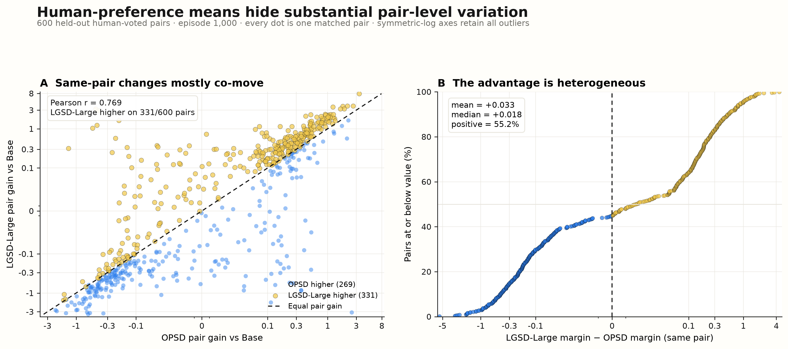
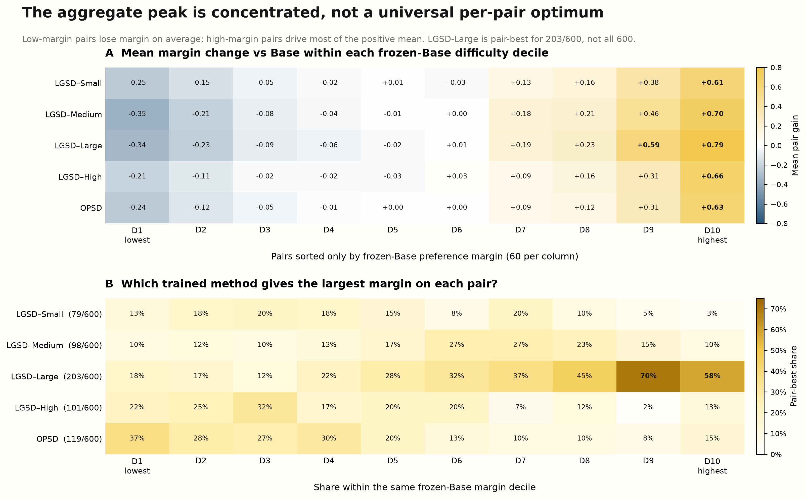
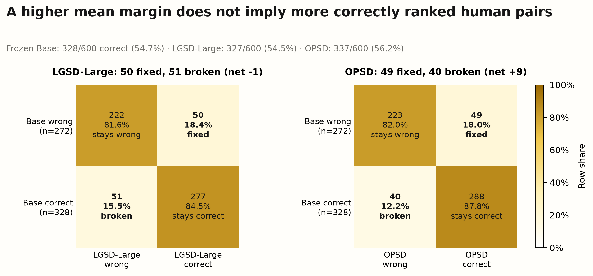
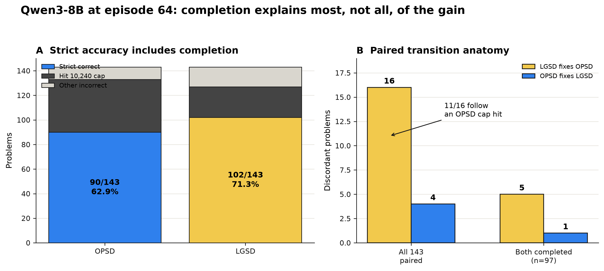
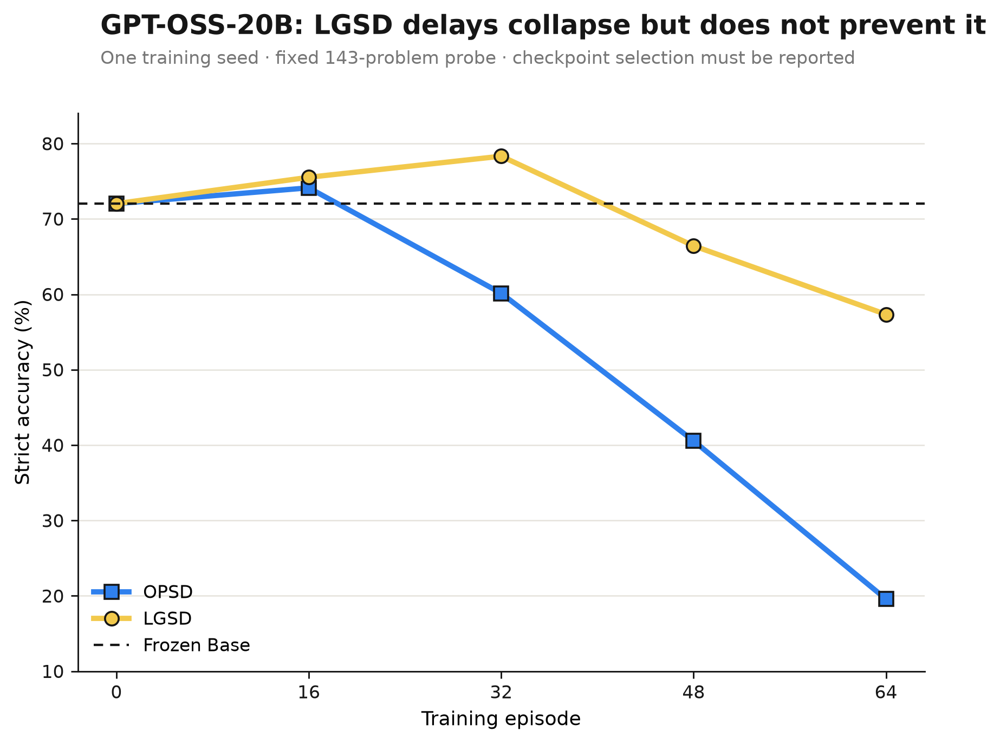

# Reviewer response and paper revision package

This package revises the claims to match the saved experiments. It separates
three kinds of statements that were previously conflated:

1. **Algebraic facts** about the geometric projection and reverse-KL fitting.
2. **Downstream measurements** such as held-out preference likelihood and strict
   math accuracy.
3. **Interpretations** such as denoising, selective transfer, and causal policy
   drift, which require stronger controls than the current evidence provides.

The defensible headline is:

> LGSD imposes a common target-space movement budget that induces a
> trajectory-adaptive reverse-KL anchor. In the evaluated runs, it is associated
> with slower policy drift and better preservation of task completion than raw
> proposal distillation. The evidence does not identify a task-only subspace,
> prove causal denoising, or establish a universal optimal radius.

## Compact revision outline

- **Method:** retain the KL-ball projection; explicitly give its equivalent
  adaptive-anchoring form under reverse-KL fitting.
- **Arena study:** replace normalized retention/surplus with absolute PrefGain,
  paired confidence intervals, and direct paired differences versus OPSD.
- **Math study:** decompose strict accuracy into completion and non-completion
  effects; do not claim pure reasoning improvement.
- **Collapse study:** report the entire checkpoint curve, best checkpoint,
  episode-64 endpoint, and normalized AUC; say “delays/mitigates,” not “prevents.”
- **Scope:** call 64 episodes a short fixed training stream, state which seed and
  overlap claims were actually tested, and list the closest missing controls.

## Point-by-point response

| # | Reviewer concern | Response from the saved evidence | Paper action |
|---:|:--|:--|:--|
| 1 | Target-side gold-token retention above alpha is tautological. | **Correct.** For the geometric path, the normalizer can create the reported ratio without learning any selective task signal. | Delete P1 as evidence of denoising; remove the normalized “surplus” criterion from the main figure and table. |
| 2 | LGSD is scalar trajectory-level interpolation, not task/style identification. | **Correct.** The projection controls magnitude along the whole privileged direction. It does not label individual components as useful or nuisance. | Replace “removes off-task signal/denoises” with “limits privileged-target movement.” |
| 3 | The closest adaptive optimizer-side baseline is missing. | **Correct, with one algebraic clarification:** alpha-scaled raw fitting alone is not the exact equivalent; the exact reverse-KL equivalent includes both an alpha-weighted raw-target term and a `(1-alpha)` old-policy anchor. | State the identity explicitly. Fixed beta, half learning rate, and fixed alpha do not isolate this explanation. Add adaptive scaling and norm-matched controls before claiming a target-vs-optimizer distinction. |
| 4 | Arena P2 is one training seed and teacher-forced likelihood, not a win rate. | **Correct on scope.** The records already support 10,000 paired bootstrap resamples over 600 pairs, but these do not measure training-seed variance. | Restore error bars; call the metric preference likelihood; state one training seed; do not say Arena win rate. |
| 5 | Qwen3-8B gain may mainly be completion. | **Largely correct.** Eleven of 16 favorable strict transitions follow an OPSD cap hit. The review's `90% vs 89%` calculation also mixes post-treatment subsets and, for LGSD, non-strict and strict numerators. | Present paired completion anatomy. Say completion stability explains most of the gain; the common-completion remainder is suggestive but not resolved. |
| 6 | Sixty-four unique math problems are not a convincing long horizon; exact overlap is weak. | **Correct.** It is a 64-episode fixed stream, not a broad long-horizon corpus. Exact normalized matching does not rule out semantic/template overlap. | Rename the setting and narrow the contamination statement. |
| 7 | Fixed order cannot establish sample-order robustness; seed evidence is Qwen-only. | **Correct.** The three Qwen3-8B runs share the same ordered DeepMath-64 manifest. | Claim reproducibility across three run seeds for Qwen3-8B only; explicitly state that order robustness was not tested. |
| 8 | GPT-OSS-20B LGSD still degrades and ends below Base. | **Correct.** LGSD peaks at episode 32 and ends at 57.34%, below Base at 72.03%; OPSD ends at 19.58%. | Report best checkpoint, endpoint, and AUC. Use “delays and mitigates collapse,” not “prevents collapse.” |
| 9 | The Pinsker-style certificate is numerically and metrically disconnected from StyleDistance. | **Correct.** At epsilon 0.004, `sqrt(2 epsilon) = 0.0894`, already much larger than the 0.006 StyleDistance threshold, and the metrics are not formally linked. | Remove the certificate as an empirical explanation for StyleDistance. Keep it, if at all, only as a loose target-distribution bound. |
| 10 | The privileged instruction is deployable at inference; the prompt-only baseline is missing. | **Correct.** No saved result evaluates frozen Base plus the identical privileged instruction at inference. | Add this baseline before arguing that training is necessary; currently list it as missing. |
| 11 | Closest controls are incomplete. | **Correct.** Existing fixed-alpha, fixed policy-KL, learning-rate, update-scale, tokenwise, LoRA, and clipping controls do not cover the requested adaptive and norm-matched alternatives. | Mark tuned global interpolation, adaptive raw scaling/anchoring, gradient-norm-matched OPSD, tuned policy-KL, early stopping, and target-projection baselines as required follow-ups. |
| 12 | RQ1 protocol is under-specified. | **Addressed in artifacts.** The run and data manifests resolve the model revision, 1K meaning, stream, prompt, split, optimizer, decoding, and exact-overlap audit. | Add the protocol table below and release the hashes/scripts with the paper. |

This response deliberately concedes points that are mathematically or
empirically valid. A rebuttal that denies them would be weaker than a narrower,
fully supported paper.

## Method correction: what reverse KL actually implies

The projected target is

\[
q^C_\alpha(v) = \frac{p(v)^{1-\alpha}q^P(v)^\alpha}{Z_\alpha}.
\]

For any audited token `g`, its projected log-gain is

\[
\log q^C_\alpha(g)-\log p(g)
=\alpha[\log q^P(g)-\log p(g)]-\log Z_\alpha.
\]

Because `Z_alpha <= 1`, every token with positive raw log-gain also has positive
projected log-gain, and its projected/raw log-gain ratio is at least `alpha`.
Thus “gold-token retention above alpha” is a property of this parameterization,
not independent evidence that learning selected task signal.

All headline saved runs identify the fitting direction as
`student_to_projected_teacher_reverse_kl_v1`. Therefore

\[
D_{\mathrm{KL}}(\pi\|q^C_\alpha)
=(1-\alpha)D_{\mathrm{KL}}(\pi\|p)
+\alpha D_{\mathrm{KL}}(\pi\|q^P)
+\log Z_\alpha.
\]

The last term is constant with respect to the fitted policy. Thus the evaluated
objective is exactly a trajectory-adaptive combination of raw-target fitting and
old-policy anchoring. The projection remains useful as a principled way to
derive `alpha` from a shared movement budget, but the current experiments cannot
support “fundamentally different from regularization.”

Forward fitting, `D_KL(q^C || pi)`, does not admit this same geometric-mixture
decomposition in general. It is a legitimate new implementation path, but its
results must be retrained and reported separately. None of the figures in this
package relabel reverse-KL checkpoints as forward-KL results.

## Revised Figure 2 and Table 1: Arena preference likelihood

The revised figure reports absolute downstream PrefGain rather than a normalized
gain-to-movement comparison. Every LGSD point has a positive paired interval
against frozen Base. LGSD-Large is the largest point estimate:

| Method | Mean alpha | Target KL/raw | PrefGain vs Base [95% CI] | Delta vs OPSD [95% CI] | PrefAcc [95% CI] |
|:--|--:|--:|:--|:--|:--|
| LGSD-Small | 0.339 | 0.012 | 0.080 [0.036, 0.126] | 0.007 [-0.015, 0.027] | 0.560 [0.520, 0.600] |
| LGSD-Medium | 0.485 | 0.053 | 0.088 [0.030, 0.147] | 0.014 [-0.022, 0.049] | 0.558 [0.518, 0.598] |
| **LGSD-Large** | **0.678** | **0.172** | **0.107 [0.032, 0.182]** | **0.033 [-0.017, 0.084]** | 0.545 [0.505, 0.585] |
| LGSD-High | 0.772 | 0.389 | 0.087 [0.045, 0.130] | 0.014 [-0.006, 0.032] | 0.552 [0.512, 0.593] |
| OPSD | 1.000 | 1.000 | 0.073 [0.033, 0.115] | 0.000 [0.000, 0.000] | 0.562 [0.522, 0.602] |

The direct LGSD-Large versus OPSD interval crosses zero. The paper-ready claim is
therefore:

> In a matched one-seed radius sweep, LGSD-Large yields the largest held-out
> preference-likelihood point estimate, while paired uncertainty does not resolve
> its difference from OPSD. Increasing alpha further moves the point estimate
> back toward OPSD.

It is not valid to call this Arena win rate or a statistically established
LGSD-over-OPSD advantage.

## Pair-level preference diagnostics beyond the alpha curve

The point-estimate peak is heterogeneous. LGSD-Large has the higher preference
margin on 331 of 600 matched pairs and OPSD on 269; their pair-level changes from
Base have Pearson `r = 0.769`. The mean direct difference is `+0.033`, while the
median is `+0.018`. This supports a small majority tendency in the saved sample,
not a uniform LGSD-Large improvement.

Sorting once by frozen-Base margin shows that all methods decrease margin on
average in D1--D4 and increase it in D7--D10. LGSD-Large is pair-best for
203/600 pairs and is most dominant in D9--D10; OPSD is more often pair-best in
the lowest-margin deciles. The aggregate Large peak is therefore concentrated
on particular pairs, especially pairs already assigned a high positive Base
margin.

Margin magnitude and correct human-pair ordering tell different stories.
LGSD-Large fixes 50 Base errors and breaks 51 Base successes, ending at 54.5%
PrefAcc; OPSD fixes 49 and breaks 40, ending at 56.2%. Accordingly, the largest
mean margin should not be described as the largest number of correctly ranked
human pairs. The underlying 600-pair table and derived heatmap tables are
released beside the figures; these diagnostics contain no KL variables.

## Completion-aware math analysis

The old `105 vs 90` shorthand mixes metrics. The complete episode-64 counts are:

| Method | Parser correct | Strict correct | Strict accuracy | Cap hits | Completed | Strict correct / completed |
|:--|--:|--:|--:|--:|--:|--:|
| OPSD | 99 | 90 | 62.94% | 43 | 100 | 90/100 = 90.0% |
| LGSD | 105 | 102 | 71.33% | 25 | 118 | 102/118 = 86.4% |

The method-specific conditional percentages are not a clean reasoning comparison:
the methods determine which examples complete, so the two denominators contain
different problems. On the common subset where both methods complete (`n=97`),
LGSD is correct and OPSD wrong on five problems; OPSD is correct and LGSD wrong
on one. The exact paired McNemar p-value is 0.21875, so this remainder is not
statistically resolved. Across all 143 problems, the paired transition is 16
versus 4 (`p=0.0118`), and 11 of the 16 favorable transitions follow an OPSD cap
hit.

The revised claim is:

> LGSD improves strict episode-64 accuracy primarily by preserving completion
> under the fixed generation budget. A smaller favorable difference remains on
> jointly completed examples, but this subset is too small to establish a
> separate reasoning-quality effect.

The unabridged saved trajectories for one completed LGSD-correct / OPSD-wrong
AMC23 case are released as
[`case_lgsd_win_opsd_lose_full.md`](../experiments/qwen3_8b_arena_preference_20260818/case_lgsd_win_opsd_lose_full.md),
with an exact-response and provenance
[`JSON companion`](../experiments/qwen3_8b_arena_preference_20260818/case_lgsd_win_opsd_lose_full.json).
LGSD retains the remainder's `+x` and obtains 23; OPSD drops that term and
returns 35. Neither response is truncated.

## Checkpoint-aware GPT-OSS-20B collapse analysis

| Method | Best episode | Best accuracy | Episode-64 accuracy | Delta vs Base at 64 | Normalized AUC 0--64 | KL-to-Base at 64 |
|:--|--:|--:|--:|--:|--:|--:|
| OPSD | 16 | 74.13% | 19.58% | -52.45 pp | 55.16% | 0.1834 |
| **LGSD** | **32** | **78.32%** | **57.34%** | **-14.69 pp** | **71.24%** | **0.0966** |

LGSD has the better best checkpoint, endpoint, normalized AUC, and lower final
KL drift in this one-seed trace, but its endpoint is still below Base. Together
with the three-decode-seed cap audit, the supported interpretation is an
association: larger accumulated drift accompanies unstable early termination
and cap-hitting behavior. It is not proof that KL drift is the sole cause.

## RQ1 reproducibility table

| Item | Saved protocol |
|:--|:--|
| Model | `Qwen/Qwen3-8B`, revision `b968826d9c46dd6066d109eabc6255188de91218` |
| Training source | User prompts from `lmarena-ai/arena-human-preference-100k`; no held-out human preference labels enter training |
| Meaning of 1K | 1,000 sequential episodes; LGSD-Large records 1,000 optimizer steps and 491,305 realized response tokens |
| Ordered stream | 1,000 unique prompt hashes, identical order across the radius sweep and OPSD |
| Training seed | `20260817` |
| Checkpoints | Episodes 0, 250, 500, and 1,000 |
| Optimizer / adapter | LoRA rank 8, LoRA alpha 16, learning rate `2e-5`, weight decay 0, max grad norm 1 |
| Training decoding | Temperature 0.6, top-p 0.95, top-k 20, maximum rollout 512, maximum sequence 8,192 |
| Distillation | Temperature 1, top-k 64, 64-token chunks, reverse KL |
| Radius sweep | 0.001, 0.004, 0.016, and 0.040; five binary-search steps |
| Privileged instruction | “Decompose the problem into explicit subgoals, track constraints and invariants, check boundary cases, and verify the chosen route against an independent alternative when possible. Use only the problem statement.” |
| Held-out source | Same LMArena dataset revision `72e85b3ddc9c81bf7b659d6b03d4126dfd8fb34a`; 600 English, single-turn, non-tie human-voted pairs |
| Held-out selection | Deterministic SHA-256 rank with seed `20260818`; normalized-prompt deduplication; train and 128 audit prompts excluded before selection |
| Split audit | 0 normalized-prompt overlaps with the excluded 1,128 prompts; 0 exact raw-text hash overlaps with the 1,000 training prompts. Semantic/template overlap was not audited |
| Preference scoring | Context 8,192; max prompt/response 4,096 each; per-response mean token log-probability, then pair macro-average; EOS excluded |
| Uncertainty | 10,000 paired percentile-bootstrap resamples over the 600 pair IDs, seed `20260824` |
| External judge | None; no Bradley--Terry fit |

## Closest-control status

| Control | Current status | What it can establish |
|:--|:--|:--|
| Fixed global alpha / interpolation | Existing single-seed control | Whether one fixed shrinkage value approximates the adaptive schedule |
| Fixed policy-KL beta | Existing single-seed control | Only whether that chosen global beta works; not equivalent to adaptive anchoring |
| Lower learning rate / half update | Existing single-seed controls | Generic global step-size effects |
| Per-trajectory alpha-scaled raw loss | Missing | Whether adaptive loss magnitude alone explains the result |
| Exact adaptive raw-target plus old-policy anchor | Algebraically identical under reverse KL | Should be presented as an equivalent implementation, not an independent empirical baseline |
| Gradient-norm-matched OPSD | Missing | Whether matched realized update norms reproduce LGSD |
| Tuned global interpolation and tuned policy-KL | Missing | Whether LGSD survives fair hyperparameter selection |
| Base plus privileged prompt at inference | Missing | Whether the deployable instruction alone yields the gain |
| Early stopping / best-checkpoint reporting | Added descriptively for GPT-OSS trace | Whether endpoint rankings are artifacts of checkpoint choice |
| TrOPD or other adaptive-target methods | Missing | Position relative to the closest literature baselines |

No table should imply that the missing controls have already been ruled out.

## Paper-ready replacement paragraphs

**Contribution.** We formulate privileged distillation as a response-level
target-movement budgeting problem. For each trajectory, a geometric projection
selects the largest interpolation coefficient whose projected target remains
within a common KL budget of the current policy. Under the reverse-KL fitting
used in our experiments, this construction admits an exact equivalent view as
trajectory-adaptive raw-target fitting plus old-policy anchoring. Our
contribution is therefore the budget-based derivation and empirical behavior of
this adaptive coefficient, not a new loss family or explicit task/style
decomposition.

**Arena result.** On 600 held-out LMArena human-preference pairs, every evaluated
LGSD radius has positive paired PrefGain relative to the frozen Base. At 1,000
training episodes, LGSD-Large has the highest point estimate, 0.107 mean
log-probability per token, with a paired 95% interval of [0.032, 0.182]. Its
paired difference from OPSD is 0.033 [-0.017, 0.084], which does not resolve an
LGSD-over-OPSD advantage. These are teacher-forced preference-likelihood
measurements, not generated-response Arena win rates, and the sweep uses one
training seed.

**Math result.** On Qwen3-8B at episode 64, LGSD raises strict accuracy from
62.94% to 71.33% and reduces cap hits from 43 to 25. Paired transition analysis
shows that 11 of 16 favorable answer flips follow an OPSD cap hit. On the 97
problems completed by both methods, the discordant count is 5 versus 1
(`p=0.21875`). The strongest supported conclusion is therefore improved
completion stability under a fixed inference budget, not proven intrinsic
reasoning improvement.

**Collapse result.** In the one-seed GPT-OSS-20B trace, LGSD reaches a higher
best accuracy and a larger checkpoint-averaged AUC than OPSD, while accumulating
less KL drift. Nevertheless, LGSD also declines after episode 32 and finishes
below the frozen Base. We conclude that target movement budgeting delays and
mitigates the observed behavioral collapse; it does not prevent degradation or
remove the need for checkpoint selection.

**Limitations.** The Arena radius sweep and GPT-OSS checkpoint trace each contain
one training seed. The three-seed Qwen3-8B study keeps sample order fixed and
does not establish data-order robustness or cross-backbone seed robustness.
Exact and normalized-text audits do not rule out semantic contamination. The
current study also lacks adaptive optimizer-side, norm-matched, inference-prompt,
and closest adaptive-target baselines. Finally, the KL budget does not formally
identify task, style, or nuisance components, and its worst-case certificate is
not numerically explanatory of the empirical StyleDistance threshold.

## Claim--evidence map

| Claim | Direct evidence | Boundary | Status |
|:--|:--|:--|:--|
| Projection enforces the configured per-trajectory target KL budget. | Saved achieved/raw target KL and solved alpha values. | Numerical implementation and top-k approximation must be stated. | Supported |
| LGSD-Large has the highest Arena PrefGain point estimate in the sweep. | 0.107 versus 0.087 or lower for other LGSD radii and 0.073 for OPSD. | One training seed; LGSD-Large minus OPSD CI crosses zero. | Supported as descriptive |
| LGSD-Large is the best alpha for every held-out pair. | It is pair-best on 203/600; the other methods are pair-best on the remaining 397. | Pair-best is descriptive on this fixed one-seed sweep. | Rejected |
| The largest mean PrefMargin implies the highest PrefAcc. | LGSD-Large has mean PrefGain 0.107 but PrefAcc 54.5%; OPSD has PrefGain 0.073 but PrefAcc 56.2%. | Both are teacher-forced likelihood diagnostics. | Rejected |
| LGSD preserves math completion better than OPSD at episode 64. | 25 versus 43 cap hits; 102 versus 90 strict correct; paired 16 versus 4 transitions. | One canonical run for this analysis. | Supported |
| LGSD intrinsically improves reasoning conditional on completion. | Common-completion transition is 5 versus 1. | `n=97`, exact p=0.21875. | Not established |
| LGSD delays GPT-OSS collapse. | Higher accuracy at episodes 32, 48, 64 and higher AUC. | One training seed. | Supported for the observed run |
| LGSD prevents collapse. | Episode-64 LGSD is below Base. | Contradicted by endpoint. | Reject claim |
| LGSD is robust to sample ordering. | Training order is fixed. | No order-randomized experiment. | Not established |
| LGSD removes style/off-task signal. | Scalar projection only. | No component identification or causal intervention. | Not established |
| Reverse-KL LGSD is fundamentally different from adaptive regularization. | Exact KL decomposition. | Objectives are algebraically identical up to a constant. | Reject claim |

## Five-dimension self-review

- **Contribution:** now framed as an interpretable, per-trajectory budget-based
  derivation rather than unsupported denoising or a novel loss family.
- **Clarity:** PrefMargin, PrefGain, PrefAcc, strict accuracy, parser correctness,
  cap hits, training seeds, and decoding seeds are explicitly separated.
- **Experimental strength:** paired uncertainty, direct OPSD differences,
  pair-level scatter/distributions, margin-decile heatmaps, correctness
  transitions, completion transitions, best checkpoint, endpoint, and AUC are
  all reported; missing controls remain labeled missing.
- **Evaluation completeness:** the package identifies where one-seed and fixed
  ordering prevent broader claims and gives a concrete follow-up list.
- **Method soundness:** reverse/forward KL are not conflated, algebraic identities
  are acknowledged, and the StyleDistance certificate is no longer used as an
  empirical explanation.

## Regeneration

`build_revision_artifacts.py` imports no model code and never loads torch. Run
its `arena`, `arena-table`, `arena-figure`, `math`, `gptoss`, and `overlap`
stages separately on memory-constrained hosts. The generated CSVs record the
bootstrap seed and replicate count. Raw checkpoints are not needed; only saved
pair-level JSONL/CSV outputs are read.

The Arena experiment directory also contains
`build_pairwise_preference_and_case.py`. Its `preference-data`, `scatter`,
`decile`, `transition`, and `case` stages reproduce the added pair-level figures,
tables, and unabridged qualitative record from saved JSONL without loading a
model.
