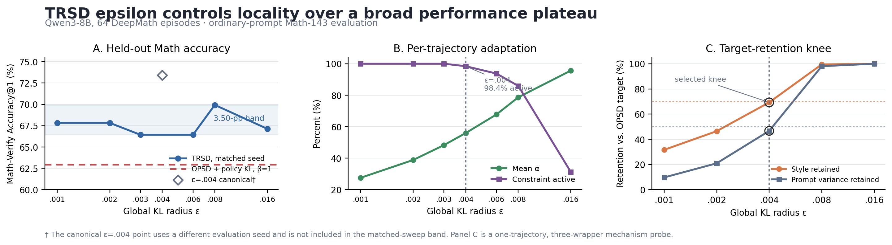

# Epsilon sensitivity and optimizer-side KL control

Last updated: 2026-08-13

## Executive conclusion

The completed Qwen3-8B sweep does **not** show a narrow performance optimum at `epsilon=0.004`. Across the six matched-seed TRSD runs from `epsilon=0.001` to `0.016`, held-out Math accuracy lies in a 3.50-point band, from 66.43% to 69.93%. Thus, performance is better described as a broad plateau than as sensitivity to one precisely tuned value. The canonical `epsilon=0.004` checkpoint reaches 73.43%, but it uses an older evaluation seed and is reported as a reference rather than used to rank epsilon values.

`epsilon=0.004` remains a defensible default because it is the projection **knee**: it keeps the constraint active on 63/64 training trajectories, uses 97.1% of the KL budget on average, and is the largest value in the existing mechanism probe that keeps style retention below 70% and prompt-variance retention below 50%. Increasing epsilon to `0.008` nearly recovers the unprojected OPSD target in that probe.

The completed optimizer-side control does not explain the result. With identical held-out query IDs and per-query seeds, OPSD plus a material frozen-Base policy-KL penalty (`beta=1`) obtains 62.94%, while every completed TRSD epsilon obtains 66.43–69.93%. This supports target-space control over that direct baseline, subject to the single-generation uncertainty and incomplete beta sweep stated below.



**Figure 1.** The matched-seed performance sweep forms a broad plateau (left); increasing epsilon smoothly raises the per-trajectory projection coefficient and lowers constraint activation (center); `epsilon=0.004` is the last tested mechanism point below both retention gates before `0.008` becomes nearly OPSD (right). The hollow `0.004` accuracy marker is a different-seed canonical reference and is excluded from the plateau range.

## Recommended epsilon guideline

> **For Qwen3-8B on DeepMath, use `epsilon=0.004`.** Treat `0.003–0.006` as the robust operating region, not as values to tune on the test set. Recalibrate after changing the backbone or task distribution; do not scale epsilon directly from parameter count.

For a new model/task pair, use the following prespecified calibration procedure:

1. Freeze 128–256 training-side calibration trajectories before looking at the test set. Balance them by a difficulty proxy such as frozen-Base reference-NLL quartile.
2. On each trajectory, score the unprojected target once and compute its endpoint divergence `K_i(1)`. Projection solves for many epsilon values reuse these scores and require no generation or optimizer step.
3. Center a three-point grid at the 5th–10th percentile of `K_i(1)`, for example `{0.5 epsilon_0, epsilon_0, 2 epsilon_0}`. This percentile targets 90–95% constraint activation.
4. Mark a candidate eligible only if, in **every difficulty quartile**, it has at least 90% constraint activation, at most 70% style retention, and at most 50% wrapper-variance retention relative to OPSD.
5. If calibration accuracy is available, retain candidates within one standard error of the best eligible value. Choose the **largest** remaining epsilon and freeze it before test evaluation.

This yields the explicit selection rule

```text
epsilon* = max { epsilon :
                 activation(epsilon) >= 90%,
                 style_retention(epsilon) <= 70%,
                 wrapper_variance_retention(epsilon) <= 50%,
                 performance(epsilon) is in the one-SE plateau }.
```

Use these diagnostics when adjusting a pilot value:

| Calibration diagnostic | Interpretation | Action for next pilot |
|---|---|---|
| Activation <90% or median alpha >0.8 | Radius is too loose; many targets are nearly OPSD | Halve epsilon |
| Style retention >70% or wrapper variance >50% | Privileged expression is insufficiently suppressed | Halve epsilon |
| Activation approximately 100%, median alpha <0.3, and useful-signal retention is low | Radius is tighter than necessary | Double epsilon |
| All gates pass across difficulty quartiles and accuracy is in the one-SE plateau | Stable locality/performance trade-off | Freeze the largest passing epsilon |

For the current Qwen3-8B evidence, `0.002` is tighter than necessary, `0.008` is already nearly OPSD, and `0.004` is the largest measured point passing both retention gates. That is why the guideline selects `0.004` even though `0.008` is the numerical maximum in one matched-seed test sweep.

### Adaptive version without a manual sweep

TRSD already adapts `alpha_i` per trajectory. The global radius can also be calibrated automatically by targeting an activation rate `r*=0.95`. For calibration block `b`, set

```text
epsilon_b = Quantile_{1-r*}({K_i(1)} in block b),
```

smooth it with an exponential moving average, and lower it whenever either retention gate is violated. An equivalent online controller is

```text
log epsilon_{b+1} = log epsilon_b + eta * (activation_b - r*),
```

with a bounded step such as at most a factor of two per block. If too many constraints are active, the controller increases epsilon; if too few are active, it decreases epsilon. Freeze the resulting radius after calibration so the held-out protocol remains fixed. This controller is a recommended extension rather than a completed empirical result; the fixed-epsilon sweep in this report validates the broad operating region on which it is based.

## Protocol

- Model: Qwen3-8B, revision `b968826d9c46dd6066d109eabc6255188de91218`.
- Training: the same 64 DeepMath trajectories, seed 0, learning rate `2e-5`, LoRA rank/alpha `8/16`, and 10,240-token rollout/sequence cap.
- Evaluation: ordinary deployment prompt, 143 held-out questions: AMC 2022/2023 (83), AIME 2024 (30), and AIME 2025 (30).
- Metric: full-response `math_verify==0.9.0` Accuracy@1. Cap hits are recorded but are not automatically forced incorrect.
- Sweep rows `0.001`, `0.002`, `0.003`, `0.006`, `0.008`, and `0.016` use the same query IDs and per-query seed family (base seed `20260808`). The policy-KL row uses this same protocol.
- The `0.004` row reuses the canonical checkpoint and its existing evaluation (base seed 0). It is not seed-paired with the other epsilon rows and is marked with a dagger.
- Only the held-out test set is reported. No development, LogicSkills, or other OOD result is included.

## Held-out Math performance

**Table 1.** Full-response Math-Verify Accuracy@1 for the 64-episode Qwen3-8B epsilon sweep. The matched-seed sweep spans only 3.50 percentage points overall; `epsilon=0.008` is the numerical maximum within that sweep. The canonical `0.004` row is reference-only because its evaluation seed differs.

| Epsilon | AMC 2022/2023 | AIME 2024 | AIME 2025 | Combined | Cap hits |
|---:|---:|---:|---:|---:|---:|
| 0.001 | 77.11% (64/83) | 56.67% (17/30) | 53.33% (16/30) | **67.83% (97/143)** | 31/143 |
| 0.002 | 78.31% (65/83) | 66.67% (20/30) | 40.00% (12/30) | **67.83% (97/143)** | 27/143 |
| 0.003 | 77.11% (64/83) | 60.00% (18/30) | 43.33% (13/30) | **66.43% (95/143)** | 38/143 |
| 0.004† | 85.54% (71/83) | 70.00% (21/30) | 43.33% (13/30) | **73.43% (105/143)** | 25/143 |
| 0.006 | 81.93% (68/83) | 53.33% (16/30) | 36.67% (11/30) | **66.43% (95/143)** | 42/143 |
| 0.008 | 79.52% (66/83) | 63.33% (19/30) | 50.00% (15/30) | **69.93% (100/143)** | 38/143 |
| 0.016 | 79.52% (66/83) | 50.00% (15/30) | 50.00% (15/30) | **67.13% (96/143)** | 45/143 |

† Canonical evaluation with a different seed family; excluded from the matched-sweep range and any claim about the optimal epsilon.

The harder 30-question AIME subsets fluctuate more than the 83-question AMC subset: across matched sweep rows, AMC spans 4.82 points, whereas each AIME subset spans 16.67 points. Because each AIME estimate has only 30 observations, this is evidence of higher measurement variance, not evidence that each dataset needs a separately tuned epsilon.

## What epsilon changes

Epsilon is global within a run, but the projection strength is already adaptive per trajectory. For trajectory `i`, TRSD solves

```text
alpha_i*(epsilon) = max { alpha in [0,1] : K_i(alpha) <= epsilon },
K_i(alpha) = mean_t KL(q_i,t^alpha || p_i,t).
```

The curves `K_i` differ by query, model state, wrapper, and teacher–student disagreement. Consequently, changing one global epsilon produces different `alpha_i` values across trajectories. A lower epsilon makes the projected target more local; a higher epsilon increases alpha and eventually makes the constraint inactive (`alpha=1`), recovering the OPSD target.

**Table 2.** Training-time projection behavior over the same 64 Qwen3-8B trajectories. `Active` counts trajectories with `alpha<1`.

| Epsilon | Mean alpha | Median alpha | Alpha range | Active | Mean achieved KL | Budget used |
|---:|---:|---:|---:|---:|---:|---:|
| 0.001 | 0.275 | 0.266 | 0.125–0.766 | 64/64 (100.0%) | 0.000944 | 94.4% |
| 0.002 | 0.388 | 0.391 | 0.156–0.625 | 64/64 (100.0%) | 0.001917 | 95.8% |
| 0.003 | 0.483 | 0.469 | 0.203–0.781 | 64/64 (100.0%) | 0.002894 | 96.5% |
| 0.004 | 0.560 | 0.547 | 0.266–1.000 | 63/64 (98.4%) | 0.003882 | 97.1% |
| 0.006 | 0.678 | 0.680 | 0.328–1.000 | 60/64 (93.8%) | 0.005819 | 97.0% |
| 0.008 | 0.787 | 0.781 | 0.344–1.000 | 55/64 (85.9%) | 0.007512 | 93.9% |
| 0.016 | 0.956 | 1.000 | 0.500–1.000 | 20/64 (31.2%) | 0.012351 | 77.2% |

The smooth increase in alpha and decrease in activation show that epsilon controls locality continuously. There is no discontinuity around `0.004`.

## Why 0.004 is the projection knee

The existing three-wrapper mechanism probe evaluates the same unprojected target at several epsilon values without retraining. It isolates how much useful-token movement and wrapper-sensitive expression survive projection.

**Table 3.** One-trajectory mechanism probe. Retention is relative to the unprojected OPSD target; this table is mechanistic evidence, not population performance.

| Epsilon | Mean alpha | Active wrappers | Useful-token gain vs. OPSD | Style retention | Prompt-variance retention |
|---:|---:|---:|---:|---:|---:|
| 0.001 | 0.323 | 3/3 | 102.7% | 31.6% | 9.7% |
| 0.002 | 0.473 | 3/3 | 124.4% | 46.4% | 20.9% |
| **0.004** | **0.702** | **3/3** | **131.9%** | **69.3%** | **46.7%** |
| 0.008 | 0.995 | 1/3 | 101.3% | 99.5% | 98.0% |
| 0.016 | 1.000 | 0/3 | 100.0% | 100.0% | 100.0% |

At `0.001–0.002`, projection is substantially stronger and retains less target movement. At `0.008`, style and wrapper variance are almost fully restored, so the target is effectively OPSD. `0.004` is the last tested point satisfying the proposed calibration gates of style retention at most 70% and prompt-variance retention at most 50%. These thresholds are a forward-looking selection guideline, not evidence that the historical run was selected by a preregistered rule. They support `0.004` as a knee, not as a universal constant or a uniquely optimal test-set value.

## Model-size and task-difficulty scaling

The same numeric epsilon is not invariant across backbones. The trajectory solver adapts alpha automatically, and its alpha distribution is the diagnostic for whether a global epsilon is too tight or too permissive.

**Table 4.** Existing `epsilon=0.004` training diagnostics across backbones and horizons. These runs are not a controlled performance sweep across model sizes, so the table supports calibration behavior only.

| Backbone | Episodes | Mean alpha | Median alpha | Alpha range | Active | Mean achieved KL |
|---|---:|---:|---:|---:|---:|---:|
| Qwen3-1.7B | 16 | 0.542 | 0.516 | 0.406–0.719 | 16/16 (100.0%) | 0.003886 |
| Qwen3-1.7B | 64 | 0.504 | 0.500 | 0.203–1.000 | 62/64 (96.9%) | 0.003837 |
| Qwen3-8B | 64 | 0.560 | 0.547 | 0.266–1.000 | 63/64 (98.4%) | 0.003882 |
| GPT-OSS-20B | 16 | 0.959 | 1.000 | 0.734–1.000 | 5/16 (31.2%) | 0.002993 |
| GPT-OSS-20B | 64 | 0.882 | 0.984 | 0.297–1.000 | 33/64 (51.6%) | 0.003352 |

For both Qwen backbones, `0.004` is active on at least 96.9% of trajectories. For GPT-OSS-20B, it is often inactive, indicating that `0.004` is comparatively permissive for that model/target pair. Therefore the recommendation is to recalibrate epsilon when the backbone or task distribution changes, rather than scaling it monotonically with parameter count.

The current DeepMath manifest has no trustworthy explicit difficulty level. Task-difficulty scaling therefore cannot be claimed from these artifacts. A prespecified proxy such as Base reference-NLL quartiles can be used in future calibration; epsilon should not be selected separately on AMC or AIME test results.

## Direct optimizer-side KL baseline

The implemented direct control adds a full-vocabulary forward KL penalty to the distillation objective:

```text
L = L_distill + beta * KL(pi_theta || pi_Base),  beta=1.
```

It is evaluated on the same ordinary-prompt questions and identical per-query seeds as the matched epsilon sweep. The penalty is material: mean policy KL is 0.00615, the KL term is 44.9% of the mean distillation loss and 31.0% of the total objective, and all 64 optimizer steps execute.

**Table 5.** Matched-seed target-space versus optimizer-side control. Every completed TRSD epsilon exceeds the policy-KL baseline.

| Method | Control | AMC 2022/2023 | AIME 2024 | AIME 2025 | Combined | Cap hits |
|---|---|---:|---:|---:|---:|---:|
| OPSD + policy KL | `beta=1` | 73.49% (61/83) | 60.00% (18/30) | 36.67% (11/30) | **62.94% (90/143)** | 61/143 |
| TRSD | `epsilon=0.001` | 77.11% (64/83) | 56.67% (17/30) | 53.33% (16/30) | **67.83% (97/143)** | 31/143 |
| TRSD | `epsilon=0.002` | 78.31% (65/83) | 66.67% (20/30) | 40.00% (12/30) | **67.83% (97/143)** | 27/143 |
| TRSD | `epsilon=0.003` | 77.11% (64/83) | 60.00% (18/30) | 43.33% (13/30) | **66.43% (95/143)** | 38/143 |
| TRSD | `epsilon=0.006` | 81.93% (68/83) | 53.33% (16/30) | 36.67% (11/30) | **66.43% (95/143)** | 42/143 |
| TRSD | `epsilon=0.008` | 79.52% (66/83) | 63.33% (19/30) | 50.00% (15/30) | **69.93% (100/143)** | 38/143 |
| TRSD | `epsilon=0.016` | 79.52% (66/83) | 50.00% (15/30) | 50.00% (15/30) | **67.13% (96/143)** | 45/143 |

The minimum observed margin over policy KL is 3.50 points (5/143), and the maximum is 6.99 points (10/143). This comparison is query-and-seed matched, but it is still one stochastic generation per question and should not be presented as a confidence-interval result.

This completed control establishes that a material `beta=1` optimizer-side penalty does not recover TRSD performance. It does not establish that every possible beta is inferior: the broader policy-KL coefficient sweep was stopped before all 143-question evaluations completed.

The reference policy is the fixed frozen Base model, not an immediately pre-update `pi_old` snapshot. Thus this is an exact frozen-reference policy-KL baseline. With one optimizer step per rollout, a freshly snapshotted `pi_old=pi_theta` has zero KL gradient at the start of that step; a meaningful PPO-style old-policy experiment would require multiple optimization epochs or a post-step proximal constraint.

## Reviewer-facing statement

> We select a global KL radius, while the projection strength is adaptive per trajectory. A 64-episode Qwen3-8B sweep over `epsilon in [0.001, 0.016]` yields a broad 66.43–69.93% matched-seed accuracy plateau rather than a sharp optimum. We retain `epsilon=0.004` because independent projection diagnostics place it at the locality knee: the constraint remains active on 98.4% of training trajectories, while increasing epsilon to 0.008 nearly restores the unprojected target's style and prompt variance. Across the same query-and-seed protocol, every tested TRSD radius also outperforms a material optimizer-side frozen-Base KL penalty by 3.50–6.99 points. We therefore treat 0.004 as a calibrated default, not a universal constant, and prescribe an activation-and-retention rule for recalibration across backbones and task distributions.

## Limitations

- The matched-seed `epsilon=0.004` evaluation was not completed; its canonical result uses a different seed and is excluded from sensitivity-range and paired claims.
- The mechanism retention grid is a three-wrapper, one-trajectory probe. Only `epsilon=0.004` has population-scale retention evidence.
- Model-size evidence compares alpha distributions from existing runs, not a full epsilon-by-model performance grid.
- The held-out evaluation contains one stochastic generation per problem; differences do not include uncertainty over decoding seeds.
- Only `beta=1` has a complete 143-question policy-KL evaluation, so this report does not identify the best possible optimizer-side coefficient.
- The policy-KL reference is frozen Base rather than dynamic `pi_old`.

## Artifact provenance

- Sweep run: `qwen3-8b-reviewer-d1-20260812` (`trsd_eps001`, `002`, `003`, `006`, `008`, `016`; test split only).
- Canonical `epsilon=0.004`: `reverse-kl-matched64-20260807` training and `budget-prompt-eval-20260807/partial_scored/trsd_ep64.jsonl` evaluation.
- Policy-KL baseline: `qwen3-8b-opsd-controls3-20260812`, variant `policy_kl1`.
- Mechanism table: `docs/results/trsd_epsilon_one_episode.csv`.
- Figure renderer: `scripts/clean_self_distill/50_plot_epsilon_report.py`.
- Scoring implementation used for this report: full-response Math-Verify as documented in `stats.md`.
